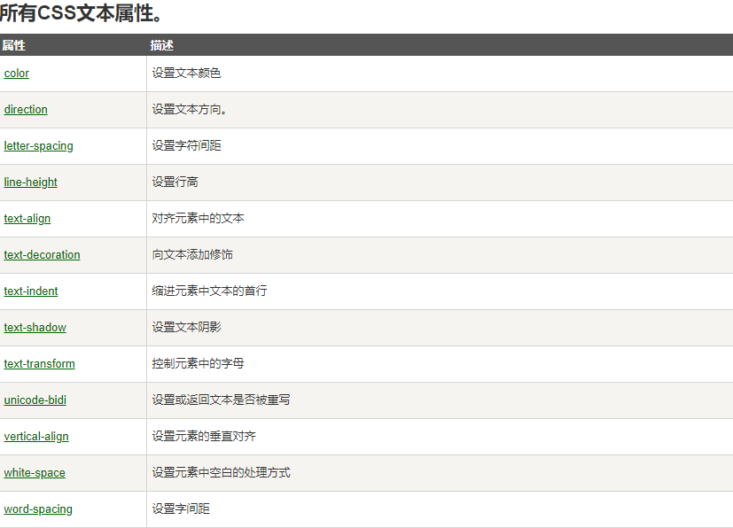

## 文本颜色

> 颜色属性被用来设置文字的颜色
>
> 颜色是通过CSS最经常的指定

* 十六进制值 - 如: ＃FF0000
* 一个RGB值 - 如: RGB(255,0,0)
* 颜色的名称 - 如: red

## 文本的对齐方式

> 文本排列属性是用来设置文本的**水平对齐方式**
>
> 文本可居中或对齐到左或右,两端对齐.

> 当**text-align设置为"justify"**，每一行被展开为宽度相等，左，右外边距是对齐（如杂志和报纸）

## 文本修饰

> **text-decoration** 属性用来设置或**删除文本的装饰**

> 从设计的角度看 text-decoration属性主要是用来删除链接的下划线

```css
a {text-decoration:none;}
```

也可以这样装饰文字

```css
h1 {text-decoration:overline;}  #横线置于文字上方
h2 {text-decoration:line-through;}  #横线置于文字中间
h3 {text-decoration:underline;}  #横线置于文字下方
```


## 文本转换

> 文本转换属性是用来指定在一个文本中的**大写和小写字母**

> 可用于所有字句变成大写或小写字母，或每个单词的首字母大写

```html
p.uppercase {text-transform:uppercase;} 字母全大写
p.lowercase {text-transform:lowercase;} 字母全小写
p.capitalize {text-transform:capitalize;}   首字母大写
```

## 文本缩进

> 文本缩进属性是用来指定文本的第一行的缩进

```css
p {text-indent:50px;}
```



