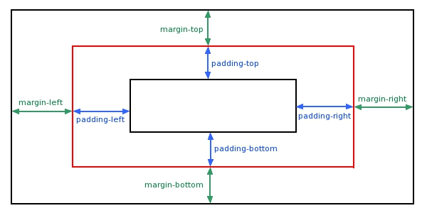
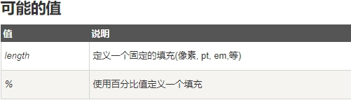

> CSS padding（填充）是一个简写属性，定义元素边框与元素内容之间的空间，即**上下左右的内边距**

## padding（填充）

> 当元素的 padding（填充）**内边距被清除时**，**所释放的区域将会受到元素背景颜色的填充。**

单独使用 padding 属性可以改变上下左右的填充

 

 

## 填充- 单边内边距属性

> 在CSS中，它可以指定不同的侧面不同的填充

```css
padding-top:25px;

padding-bottom:25px;

padding-right:50px;

padding-left:50px;
```


## 填充 - 简写属性

> 所有的填充属性的简写属性是 padding

```css
padding:25px 50px;
```


 