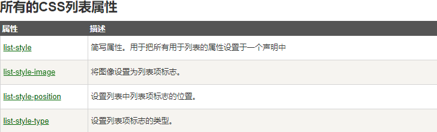

> CSS 列表属性作用如下：

* 设置不同的列表项标记为有序列表
* 设置不同的列表项标记为无序列表
* 设置列表项标记为图像

## 列表

在 HTML中，有两种类型的列表：

* **无序列表 ul** - 列表项标记用特殊图形（如小黑点、小方框等）
* **有序列表 ol** - 列表项的标记有数字或字母

> 使用 CSS，可以列出进一步的样式，并可用图像作列表项标记

不同的列表项标记

list-style-type属性指定列表项标记的类型是

```css
ul.a {list-style-type: circle;}
ul.b {list-style-type: square;}
ol.c {list-style-type: upper-roman;}
ol.d {list-style-type: lower-alpha;}
```

**作为列表项标记的图像**

>  要指定列表项标记的图像，使用列表样式图像属性

```css
ul
{
    list-style-image: url('sqpurple.gif');
}
```

## 列表 - 简写属性

> 在单个属性中可以指定所有的列表属性。这就是所谓的简写属性

```css
ul
{
    list-style: square url("sqpurple.gif");
}
```

## 移除默认设置

> list-style-type:none 属性可以用于**移除小标记**。**默认**情况下列表 **<ul> 或 <ol> **还设置了**内边距和外边距**，可**使用 margin:0 和 padding:0 来移除**

```css
ul {
  list-style-type: none;
  margin: 0;
  padding: 0;
}
```



