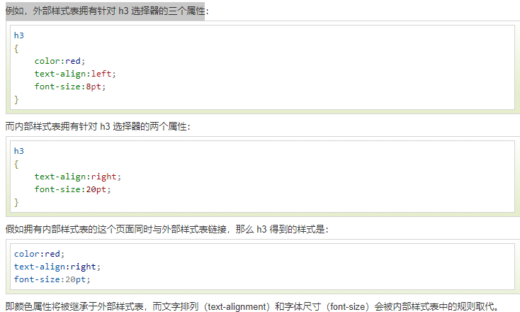

> 当读到一个样式表时，浏览器会根据它来**格式化 HTML 文档**

## 如何插入样式表

插入样式表的方法有三种:

```b
外部样式表(External style sheet)
内部样式表(Internal style sheet)
内联样式(Inline style)
```

## 外部样式表

> 当样式需要**应用于很多页面时**，外部样式表将是理想的选择。在使用外部样式表的情况下，你可以通过改变一个文件来**改变整个站点的外观**。每个页面使用 `<link> `标签链接到样式表。** <link> 标签在（文档的）头部**

```html
<head>
<link rel="stylesheet" type="text/css" href="mystyle.css">
</head>
```

> 浏览器会从文件 **mystyle.css 中读到样式声明**，并根据它来格式文档

> 外部样式表可以在**任何文本编辑器中进行编辑**。文件**不能包含任何的 html 标签。样式表应该以 .css 扩展名进行保存**

```css
hr {color:sienna;}
p {margin-left:20px;}
body {background-image:url("/images/back40.gif");}
```

> **不要在属性值与单位之间留有空格（如："margin-left: 20 px" ），正确的写法是 "margin-left: 20px"**

## 内部样式表

> 当单个文档需要**特殊的样式时**，就应该使用内部样式表。你可以使用 `<style>` 标签在**文档头部定义内部样式表**

```html
<head>
    <meta charset="utf-8">
    <title>CSS</title>
   <style>
         h1 {color: blue;}
        p {color: red;}
   </style>
</head>
<body>
   <h1>样式1</h1>
   <p>样式2</p>
</body>
```

## 内联样式

> 由于要将表现和内容混杂在一起，**内联样式会损失掉样式表的许多优势**。**请慎用这种方法**，例如当样式仅需要在一个元素上应用一次时

要使用内联样式，你需要在相关的标签内使用样式**（style）**属性。Style 属性可以包含任何 CSS 属性

```html
<p style="color:sienna;margin-left:20px">这是一个段落。</p>
```

## 多重样式

> **如果某些属性在不同的样式表中被同样的选择器定义，那么属性值将从更具体的样式表中被继承过来**



## **多重样式优先级**

一般情况下，优先级如下

> **内联样式 > 内部样式表 > 外部样式表 > 浏览器样式表**

如果外部样式放在内部样式的后面，则外部样式将覆盖内部样式

