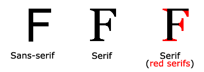
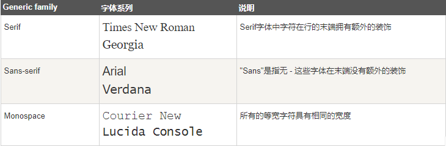
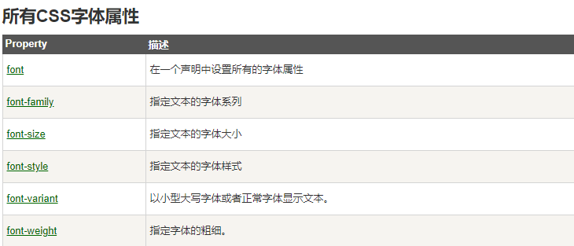

> CSS字体属性定义字体，加粗，大小，文字样式

serif和sans-serif字体之间的区别



> 在计算机屏幕上，sans-serif字体被认为是比serif字体容易阅读

## CSS字型

在CSS中，有两种类型的字体系列名称

通用字体系列 - 拥有相似外观的字体系统组合（如 "Serif" 或 "Monospace"）

特定字体系列 - 一个特定的字体系列（如 "Times" 或 "Courier"）



## 字体系列

> font-family 属性设置文本的字体系列
>
> font-family 属性应该设置几个字体名称作为一种"后备"机制，如果浏览器不支持第一种字体，他将尝试下一种字体
>
> **注意: 如果字体系列的名称超过一个字，它必须用引号，如Font Family："宋体"**

> 多个字体系列是用一个逗号分隔指明

```css
p{font-family:"Times New Roman", Times, serif;}
```

## 字体样式

> 主要是用于指定斜体文字的字体样式属性

这个属性有三个值

* 正常 - 正常显示文本
* 斜体 - 以斜体字显示的文字
* 倾斜的文字 - 文字向一边倾斜（和斜体非常类似，但不太支持）

```css
p.normal {font-style:normal;}
p.italic {font-style:italic;}
p.oblique {font-style:oblique;}
```

## 字体大小

> font-size 属性设置文本的大小
>
> 字体大小的值可以是绝对或相对的大小

> 绝对大小：

* 设置一个指定大小的文本
* 不允许用户在所有浏览器中改变文本大小
* 确定了输出的物理尺寸时绝对大小很有用

> 相对大小：

* 相对于周围的元素来设置大小
* 允许用户在浏览器中改变文字大小

> **如果你不指定一个字体的大小，默认大小和普通文本段落一样，是16像素（16px=1em）**

## 设置字体大小像素

设置文字的大小与像素，让您完全控制文字大小

```css
h1 {font-size:40px;}
h2 {font-size:30px;}
p {font-size:14px;}
```


## 用em来设置字体大小

> 为了**避免Internet Explorer 中无法调整文本的问题**，许多开发者使用 **em 单位代替像素**

em的尺寸单位由W3C建议

> **1em和当前字体大小相等。在浏览器中默认的文字大小是16px**

```css
h1 {font-size:2.5em;} /* 40px/16=2.5em */
h2 {font-size:1.875em;} /* 30px/16=1.875em */
p {font-size:0.875em;} /* 14px/16=0.875em */
```

## 使用百分比和EM组合

> **在所有浏览器的解决方案中，设置 <body>元素的默认字体大小的是百分比**

```css
body {font-size:100%;}
h1 {font-size:2.5em;}
h2 {font-size:1.875em;}
p {font-size:0.875em;}
```



