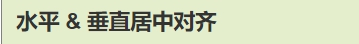

 

## 元素居中对齐

> 要水平居中**对齐一个元素**(如 <div>), 可以使用 **margin: auto;。**
>
> 设置到**元素的宽度**将**防止它溢出**到容器的边缘。

元素通过指定宽度，并将两边的空外边距平均分配：

```css
.center {

  margin: auto;

  width: 50%;

  border: 3px solid green;

  padding: 10px;

}
```

> **注意: 如果没有设置 width 属性(或者设置 100%)，居中对齐将不起作用**

## 文本居中对齐

> 如果仅仅是为了**文本在元素内居中对齐**，可以使用**text-align: center;**

```css
.center {

  text-align: center;

  border: 3px solid green;

}
```

## 图片居中对齐

> 要让图片居中对齐, 可以使用 margin: auto; 并将它放到 块 元素中

```css
img {

  display: block;

  margin: auto;

  width: 40%;

}
```

## 左右对齐 - 使用定位方式

> 我们可以使用 position: absolute; 属性来对齐元素

```css
.right {

  position: absolute;

  right: 0px;

  width: 300px;

  border: 3px solid #73AD21;

  padding: 10px;

}
```

> **注意：绝对定位元素会被从正常流中删除，并且能够交叠元素
> 提示: 当使用 position 来对齐元素时, 通常 <body> 元素会设置 margin 和 padding 。 这样可以避免在不同的浏览器中出现可见的差异**

## 左右对齐 - 使用 float 方式

我们也可以使用 float 属性来对齐元素

```css
.right {

  float: right;

  width: 300px;

  border: 3px solid #73AD21;

  padding: 10px;

}
```

当像这样对齐元素时，对 <body> 元素的外边距和内边距进行预定义是一个好主意。这样可以避免在不同的浏览器中出现可见的差异

> **注意：如果子元素的高度大于父元素，且子元素设置了浮动，那么子元素将溢出，这时候你可以使用 "clearfix(清除浮动)" 来解决该问题**

 

