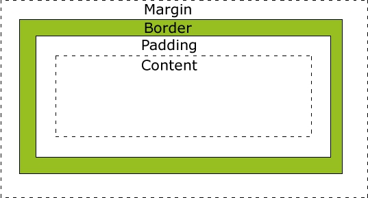
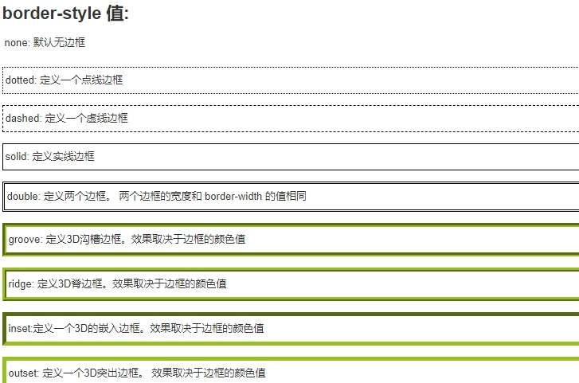

> **所有HTML元素**可以看作**盒子**，在CSS中，"box model"这一术语是用来设计和布局时使用。

> **CSS盒模型本质上是一个盒子**，**封装周围**的HTML元素，它**包括：边距，边框，填充，和实际内容**。

> 盒模型允许我们在其它元素和周围元素边框之间的空间放置元素。

下面的图片说明了盒子模型(Box Model)：

 

* Margin(外边距) - 清除边框外的区域，外边距是透明的。

* Border(边框) - 围绕在内边距和内容外的边框。

* Padding(内边距) - 清除内容周围的区域，内边距是透明的。

* Content(内容) - 盒子的内容，显示文本和图像。

## 元素的宽度和高度

> 当您指定一个 CSS 元素的宽度和高度属性时，你只是设置内容区域的宽度和高度。要知道，完整大小的元素，你还必须添加内边距，边框和外边距

 

CSS 边框属性

CSS边框属性允许你指定一个元素边框的样式和颜色

边框样式

边框样式属性指定要显示什么样的边界

border-style属性用来定义边框的样式

 

对应语法：

边框宽度

您可以通过 border-width 属性为边框指定宽度

为边框指定宽度有两种方法：可以指定长度值，比如 2px 或 0.1em(单位为 px, pt, cm, em 等)，或者使用 3 个关键字之一，它们分别是 thick 、medium（默认值） 和 thin。

注意：CSS 没有定义 3 个关键字的具体宽度，所以一个用户可能把 thick 、medium 和 thin 分别设置为等于 5px、3px 和 2px，而另一个用户则分别设置为 3px、2px 和 1px

p.one

{

  border-style:solid;

  border-width:5px;

}

p.two

{

  border-style:solid;

  border-width:medium;

}

注意: "border-width" 属性 如果单独使用则不起作用。要先使用 "border-style" 属性来设置边框。

边框颜色

border-color属性用于设置边框的颜色。可以设置的颜色

· 

name - 指定颜色的名称，如 "red"

· 

· 

RGB - 指定 RGB 值, 如 "rgb(255,0,0)"

· 

· 

Hex - 指定16进制值, 如 "#ff0000"

· 

您还可以设置边框的颜色为"transparent"

注意： border-color单独使用是不起作用的，必须得先使用border-style来设置边框样式

p.one

{

  border-style:solid;

  border-color:red;

}

p.two

{

  border-style:solid;

  border-color:#98bf21;

}

边框-单独设置各边

在CSS中，可以指定不同的侧面不同的边框

p

{

  border-top-style:dotted;

  border-right-style:solid;

  border-bottom-style:dotted;

  border-left-style:solid;

}

上面的例子也可以设置一个单一属性

border-style:dotted solid;

border-style属性可以有1-4个值

border-style:dotted solid double dashed;

· 

上边框是 dotted

· 

· 

右边框是 solid

· 

· 

底边框是 double

· 

· 

左边框是 dashed

· 

border-style:dotted solid double;

· 

上边框是 dotted

· 

· 

左、右边框是 solid

· 

· 

底边框是 double

· 

border-style:dotted solid;

· 

上、底边框是 dotted

· 

· 

右、左边框是 solid

· 

border-style:dotted;

· 

四面边框是 dotted

· 

边框-简写属性

上面的例子用了很多属性来设置边框。

你也可以在一个属性中设置边框。

你可以在"border"属性中设置

· 

border-width

· 

· 

border-style (required)

· 

· 

border-color

· 

CSS 边框属性

 

 

