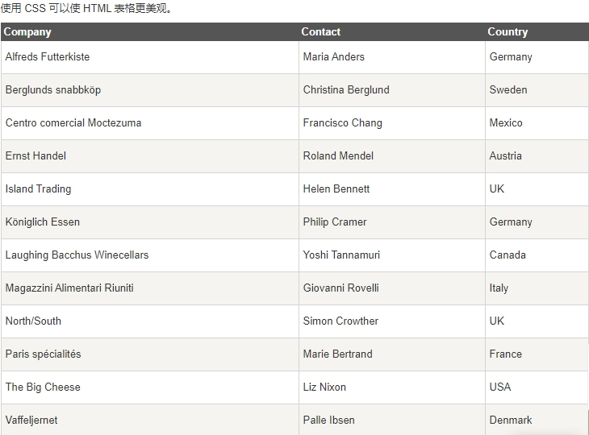

 

## 表格边框

> 指定**CSS表格边框**，使用**border属性**。

> 为了显示一个表的**单个边框**，使用** border-collapse属性**

## 折叠边框

> border-collapse 属性设置表格的边框是否被折叠成一个单一的边框或隔开

```css
table

{

  border-collapse:collapse;

}

table,th, td

{

  border: 1px solid black;

}
```


## 表格宽度和高度

> Width和height属性定义表格的宽度和高度。

下面的例子是设置100％的宽度，50像素的th元素的高度的表格

```css
table

{

  width:100%;

}

th

{

  height:50px;

}
```


## 表格文字对齐

> 表格中的**文本对齐和垂直对齐属性。**

> **text-align属性**设置水平对齐方式，向左，右，或中心

```css
td

{

  text-align:right;

}
```


> 垂直对齐属性设置垂直对齐，比如顶部，底部或中间

```css
td

{

  height:50px;

  vertical-align:bottom;

}
```


## 表格填充

> 如需控制边框和**表格内容之间的间距**，应使用**td和th元素**的填充属性

```css
td

{

  padding:15px;

}
```


## 表格颜色

> 下面的例子指定边框的颜色，和th元素的文本和背景颜色

```css
table, td, th

{

  border:1px solid green;

}

th

{

  background-color:green;

  color:white;

}
```


