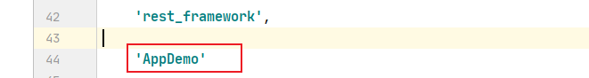
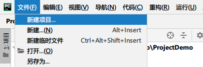
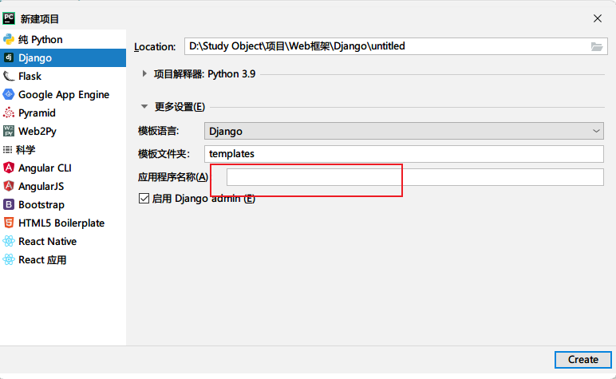
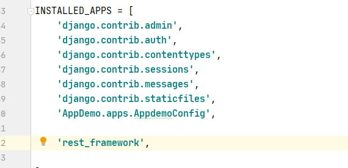
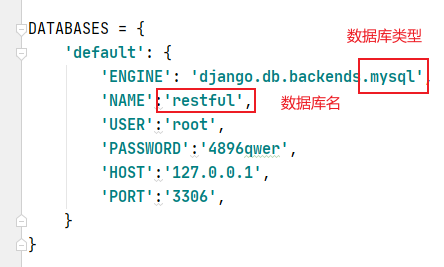
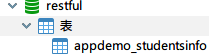
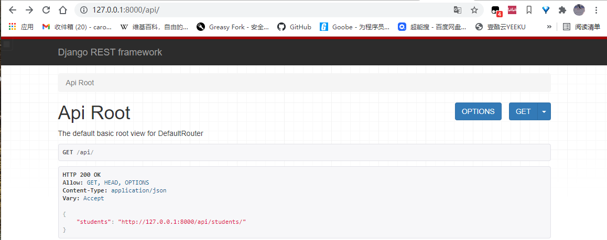

## 创建工程和应用

> 方法1:

```python
django-admin startproject ProjectDemo
django-admin startapp AppDemo
```

**然后需要手动到setting文件中注册应用**



> 方法2:





配置应用名，**自动注册应用**

## 注册rest_framework应用



## 创建、迁移模型，并添加数据

```python
from django.db import models

class StudentsInfo(models.Model):
    #学生信息模型
    #以下信息学生表中的各个字段verbose_name相当于给字段取了一个别名，将来在管理页面会显示这个别名，否则显示字段名。例如，如果设置了verbose_name，那么在管理页面中，s_name字段将一“学生姓名”显示出来，如果没有设置verbose_name，则直接显示“s_name”。verbose_name只是方便用户以后的使用，设置与否不影响内部数据的存储
    s_name = models.CharField(max_length=8, verbose_name='学生姓名')
    s_age = models.IntegerField(verbose_name='学生年龄')
    s_number = models.CharField(max_length=16, verbose_name='学号')
```

设置数据库，在这里我们使用mysql数据库所需要配置



> 然后在mysql中手动创建数据库为**restful**的数据库

```sql
create database restful default charset=utf8;
```

> 终端中运行命令以迁移模型

```bas
py manage.py makemigrations
py manage.py migrate
```

数据库中查看生成的表



手动添加数据即可

## 创建序列化器

在 AppDemo 应用中新建 serializers.py用于保存该应用的序列化器

创建一个 `StudentsSerializer `用于序列化与反序列化学生信息：

```python
from rest_framework import serializers
from AppDemo.models import StudentsInfo

class StudentsSerializer(serializers.ModelSerializer):
	
    class Meta:
        #对StudentsModel进行序列化
        model = StudentsInfo
        # __all__表示对 StudentsModel 中所有字段序列化进行序列化
        fields = '__all__'
```

* **model** ：指明该序列化器处理的数据字段从模型类 StudentsModel 参考生成
* **fields** ：指明该序列化器包含模型类中的哪些字段，'**all**’指明包含所有字段

## 编写视图

在应用的 views.py中创建视图 StudensInfoViewSet，这是一个视图集合

```python
from rest_framework import viewsets
from AppDemo.models import StudentsInfo
from AppDemo.serializers import StudentsSerializer

class StudentsViewSet(viewsets.ModelViewSet):

    queryset = StudentsInfo.objects.all()
    # 使用上一步创建的StudentsSerializer对模型进行序列化
    serializer_class = StudentsSerializer
```

* **queryset** 指明该视图集在查询数据时使用的查询集
* **serializer_class** 指明该视图在进行序列化或反序列化时使用的序列化器。

## 定义路由

在 ProjectDemo 的 urls.py中定义路由信息

```python
from django.contrib import admin
from django.urls import path, include
from rest_framework import routers
from AppDemo.views import StudentsViewSet


router = routers.DefaultRouter() # 创建路由器
router.register(r'students', StudentsViewSet) # 在路由器中注册视图集路由地址

urlpatterns = [
    path('admin/', admin.site.urls),
    # 拼接路由路径
    path('api/',include(router.urls)),
]
```

## 运行测试

```bash
py manage.py runserver
```



