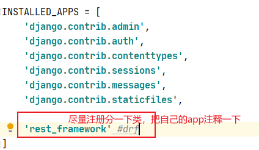
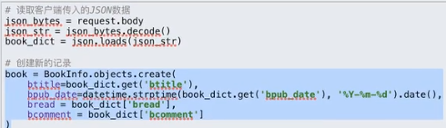
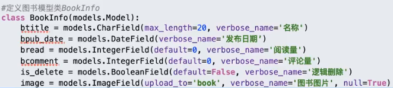
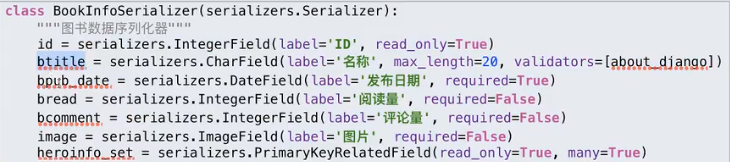

> 安装rest framework框架

```
pip install djangorestframework
```

> 在setting.py中



> 需要先了解的一些知识

* 理解下面两个知识点非常重要，django-rest-framework源码中到处都是**基于CBV和面向对象的封装**
  * **面向对象封装的两大特性**
    1.把同一类方法封装到类中
    2.将数据封装到对象中

  * **CBV**
    基于反射实现根据请求方式不同，执行不同的方法

    原理：url-->view方法-->dispatch方法（反射执行其它方法：GET/POST/PUT/DELETE等等）

## 序列化

> 在开发REST API接口时，视图中做的最主要有三件事：

```
1.将请求的数据(如json格式)转换为模型类对象（反序列化）
2.操作数据库
3.将模型类对象转换为响应的数据(如json格式)（序列化）
```

> 概念：将程序中的一个数据结果类型转出为其他格式（字典、json、xml等）序列化行为：


> 序列化时机：当需要给前端响应模型数据时，需要将模型数据**序列化**成前端需要的格式

## 反序列化

> 概念：将其他格式（字典、json等）转换为程序中的数据

反序列化行为：



> 反序列化时机：当需要将用户发送的数据**存储到数据库之前**，需要使用**反序列化**

## Serializers序列化器

> Serializers序列化器就是一个类似于**模型类的类**
>
> **序列化器里面的字段必须和模型类里的字段名字相同，类型相同,但是数量不用一直，可多可少**
>
> 序列化器的东西需要**单独创建一个Serializers.py文件写**
>
> **模型类和序列化器的父类不一样**

```python
导入Serializer
from rest_framework import serializers
```

> 模型类：



> 序列化器：



```python
在序列化器中的
label:表示的是在网页中的标题选项
read_only:表示只读，read_nonly=True表示id这个字段将来只做模型转字典这个动作，不写read_only这个属性的字段表示，既可以序列化也可以反序列化，就是又可以输出，又可输入
write_only：表示只写，默认为false，就是字典转模型，注意：不能和read_only都为True
required:不写的话默认为True，True的话表示前端必须传这个字段给我，False的话就可以不传，注意这个字段是基于模型类的字段是否传默认值（defalut）而定的
```

## 序列化器用法：

```python
序列化：
序列化器类名(instace, data)
如果只给instace形参传递参数表示只做序列化
serializer = 序列化器类名(instace = xxx)  #如果放的是查询集那就需要添加many=True参数,如果只是单数据一就不用
serializer.data  #获取到序列化后的数据
反序列化：
序列化器类名(instace, data)
反序列化的话就给data传一个（json、字典等）就可以了
```

