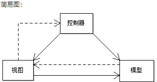
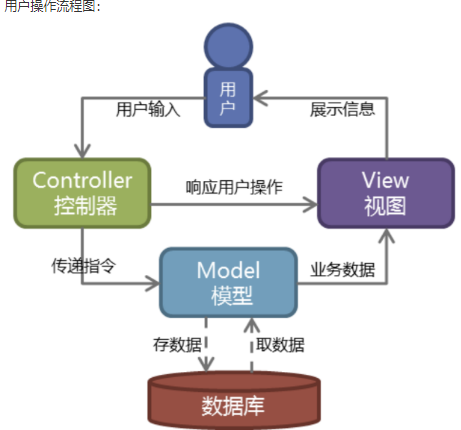
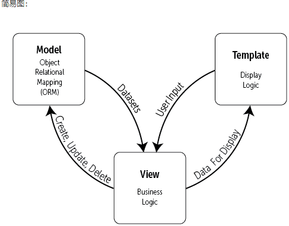
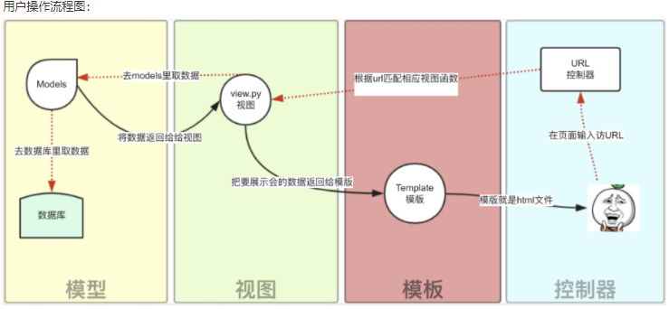

## Django简介

> Django 是一个由 Python 编写的一个开放源代码的 Web 应用框架。

使用 Django，只要很少的代码，Python 的程序开发人员就可以轻松地完成一个正式网站所需要的大部分内容，并进一步开发出全功能的 Web 服务 Django 本身基于**MVC 模型**，即 **Model（模型）**+ **View（视图）**+ **Controller（控制器）**设计模式，MVC 模式使后续对程序的修改和扩展简化，并且使程序某一部分的重复利用成为可能。

### MVC优势

* 低耦合
* 开发快捷
* 部署方便
* 可重用性高
* 维护成本低
* ....

> Python加Django是快速开发、设计、部署网站的最佳组合

特点

* 强大的数据库功能
* 自带强大的后台功能
* 优雅的网址

---

## MVC与MTV模型

### MVC模型

> MVC 模式（Model–view–controller）是软件工程中的一种软件架构模式，把软件系统分为三个基本部分：模型（Model）、视图（View）和控制器（Controller）
>
> MVC 以一种插件式的、松耦合的方式连接在一起。

* 模型（M）：编写程序应有的功能，负责业务对象与数据库的映射（ORM）
* 视图（V）：图形界面，负责与用户的交互（页面）
* 控制器（C）：负责转发请求，对请求进行处理
* 简易图





### MTV模型

> Django 的 MTV 模式本质上和 MVC 是一样的，也是为了各组件间保持松耦合关系，只是定义上有些许不同，Django 的 MTV 分别是指：

* M表示（Model）：编写程序应有的功能，负责业务对象与数据库的映射**（ORM）**
* T表示模板（Template）：负责如何把页面（html）展示给用户
* V表示视图（View）：负责业务逻辑，并在适当时候调用Model和Template
  除了以上三层之外，还需要一个 URL 分发器，它的作用是将一个个 URL 的页面请求分发给不同的 View 处理，View 再调用相应的 Model 和 Template，MTV 的响应模式如下所示：





> 解析：用户通过浏览器向我们的服务器发起一个请求（request），这个请求会去访问视图函数

* 如果不涉及到数据调用，那么这个时候视图函数直接返回一个模板就是一个网页给用户
* 如果设计到数据调用，那么视图函数调用模型，模型去数据库查找数据，然后逐级返回

---

## 创建Django

### 安装Django

```python
pip install Django
```

### 创建项目

```python
django-admin startproject 项目名
```

```python
|---mysite # 项目的/目录
  |---mysite # 项目目录
      |---__init__.py
      |---settings.py # 配置文件
      |---urls.py # 路由系统 ===> url与视图的对应关系
      |---wsgi.py # runserver命令就使用wsgiref模块做简单的web server
|---manage.py # 管理文件
```

### 创建应用

```python
cd mysite#先切换到manage.py所在根目录
manage.py startapp 应用名
py manage.py runserver#运行项目
```

### 创建第一个项目

```python
django-admin startproject HelloWorld
```

### 视图和URL配置

```python
#在先前创建的 HelloWorld 目录下的 HelloWorld 目录新建一个 views.py 文件，并输入代码：
from django.http import HttpResponse

def hello(request):
    return HttpResponse("Hello world ! ")
```

```python
#接着，绑定 URL 与视图函数。打开 urls.py 文件，删除原来代码，将以下代码复制粘贴到 urls.py 文件中：
from django.conf.urls import url
from . import views

urlpatterns = [
    url(r'^$', views.hello),
]
```

### 测试

```python
 **必须切换到mannage.py根目录下**
cd HelloWorld

py manage.py runserver
```

---

## path()函数

> **Django path()可以接收四个参数，分别是两个必选参数：route、view和两个可选参数：kwargs、name**

```python
from django.urls import path
path(route, views, name=None)
```

* route:字符串，表示URL规则，与之匹配的URL会执行对应的第二个参数view
* views:用于执行与正则表达式匹配的URL请求
* name:用来反向获取URL,为地址起别名

