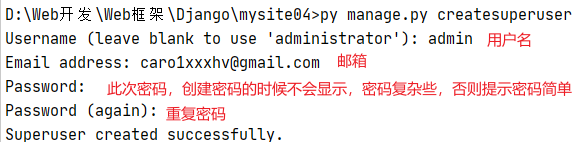
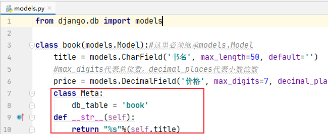
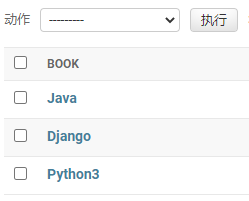

## admin配置步骤

> 创建后台管理账号-**该账号为管理后台最高权限账号（不要泄露）**

```python
项目根目录下
py manage.py createsuperuser
```



此处设置的密码是4896qwer

登录之后就可以在admin管理后台设置用户

用户权限，用户组等

## 注册自定义模型类

> 定义自己的模型类也能在admin后台管理界面中显示和管理
>
> 需要将自己的类注册到后台管理界面

注册步骤：

```python
1.在应用app中的admin.py中导入注册要管理的模型models类
from .models import book  #相对导入
2.调用admin.site.register 方法进行注册
admin.site.register(自定义模型类)
```

在应用目录下的models.py文件中定义`__str__`函数可以让admin后台管理看到定义的格式：





## 模型管理器

> 作用：为后台管理界面添加便于操作的新功能、样式

说明：

> **后台管理器类必须继承自django.contrib.admin里的ModelAdmin类**

使用方法：

```python
1.在<应用app>/admin.py里定义模型管理器
class "模型类名+Manager"(admin.ModelAdmin):
2.绑定注册模型管理器和模型类
from django.contrib import admin
from .models import *
admin.site.register(模型类名, 管理器名)
```

```python
实例
from django.contrib import admin
from .models import book

class bookManager(admin.ModelAdmin):
        #列表页显示那些字段的列
    list_display = ['id', 'title', 'price']
    #控制list_display中的字段，那些可以链接到修改页
    list_display_links = ['title'] #这里面的值必须是list_display里面有的
    #添加过滤器
    list_filter = ['title']
    #添加搜索框[模糊搜索]
    search_fields = ['title']
    #添加可以再列表页编辑的字段  注意：list_editable和lits_display_links是互斥的，两个不能用同样的值，而且也必须在list_display里面存在的值
    list_editable = ['price']

admin.site.register(book, bookManager)
```

更多模型管理器类查看官网(https://docs.djangoproject.com/zh-hans/3.2/ref/contrib/admin/)

