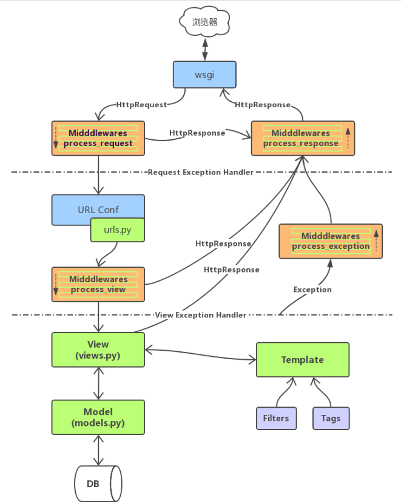

## 中间件的定义

> 中间件事Django请求/响应处理的**钩子框架**，它是一个轻量级的、低级的**“插件”系统**，用于**全局改变**Django的**输入（请求）**或**输出（响应）**


> 相当于在每个**关卡**的时候就可以使用中间件，中间件充当一个**收费站的形象**中间件以**类**的形式体现

## 编写中间件

```python
中间件类必须继承自django.utils.deprecation.MiddlewareMixin类
中间件类须实现下了五个方法中的一个或多个
这些方法必须按照这个样式写，字母，方法名，参数都不能错，写好之后Django会自动调用：
process_request(self, request)
    执行路由之前被调用，在每个请求上调用，返回None(可以执行下一步)或HttpResponse对象(不能继续执行，返回客户端)
process_view(self, request, callback, callback_args, callback_kwargs)
    调用视图之前被调用，在每个请求上调用，返回None(可以执行下一步)或HttpResponse对象(不能继续执行，返回客户端)
process_response(self, request, reponse)
    所有响应返回浏览器之前被调用，在每个请求上调用，返回HttpResponse对象
process_exception(self, request, exception)
    当处理过程中抛出异常时调用，返回一个HttpResponse对象
process_template_response(self, request, response)
    在视图函数执行完毕且视图返回对象中包含render方法时被调用，该方法需要返回试了render方法的响应对象

注意：中间件中的大多数方法在返回None时表示忽略当前操作进行下一项时间，当返回HttpResponse对象时表示此请求接收，直接返回给客户端
```

## 注册中间件

```python
在setting.py中需要注册一下自定义的中间件
MIDDLEWARE = [
    ........#这里面注册
]
#注意：配置为数组，中间件被调用时 进入视图之前以‘先上再下’ 进入视图之后再‘由下到上’的顺序调用
```

> 一般情况下都是在项目文件目录下新建一个文件夹middleware
>
> 然后再在middleware里创建一个`__init__`.py文件
>
> 再创建自己自定义的自定义中间件文件.py

中间件执行总流程图



## **CSRF-跨站伪造请求攻击**

```python
某些恶意网站上包含链接、表单按钮或者javaScript，它们会利用登陆过的用户在浏览器中的认证信息试图在你的网站上完成某些操作，这就是跨站请求伪造(CSRF,即Cross-Site Request Forgey)
```

### **CSRF防范**

```python
1.setting.py中确定MIDDLEWARE中django.middleware.csrf.CsrfViewMiddleware是否打开
2.模板中，form标签下添加如下标签
    
```

