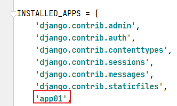
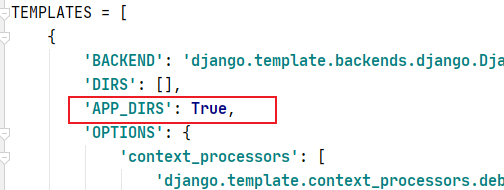

## 应用

> 应用指的是一个网站中的所有板块，我们可以使用应用来细化每个板块，让每个应用执行自己的代码，互不干扰

### 创建应用

```python
#在manage.py根目录下使用命令创建应用文件夹
py manage.py startapp 应用名
```

### 注册应用

> 在主目录下的setting.py中的INSTALLED_APPS中添加应用名注册



---

## 分布式路由

> 让每个应用独立处理属于自己的连接，根目录下的主路由（urls.py）只处理地址的分发工作，找到了指定的应用就把地址交由应用自己的路由处理（这就叫分布式路由）

### 主路由中调用include函数

```python
include('app名字.url模块名')
```

```python
实例
#使用http://127.0.0.1:8000/app01/index
#urls.py
from django.contrib import admin
from django.urls import path,include  #这里需要导入include

urlpatterns = [
    path('admin/', admin.site.urls),
    path('app01/', include('app01.urls'))
]
#主路由一旦匹配到app01就执行include
#app01.urls代表交由app01应用下的urls去处理
```

### 应用下配置urls.py

> **在应用里是没有urls.py文件的，需要手动创建出来**

> 应用下的urls.py文件和主路由文件完全一样

```python
#应用下的urls.py
from django.urls import path
from . import views

urlpatterns = [
    path('index', 视图函数)
]
#这里的路由之后匹配主路由没有匹配完的地址
```

---

## 应用下的模板

> 应用内部可以配置模板目录

1. 应用下需要手动创建templates文件夹
2. setting.py中，开启模板功能



应用下templates和主目录下的templates都存在时，django的查找模板规则

1. 优先查找外层templates目录下的模板
2. 按INSTALLED_APPS配置下的 应用顺序 逐层查找

> 如果在应用层下创建templates，在应用views.py里面的 HttpRespone也需要使用render渲染模板，**如果每个应用的templates里面出现了同名的模板那么就有可能出现查找模板顺序出错的情况**

避免出现这种情况

```python
在应用目录下的templates目录里面的文件新建一个和应用名同名的文件夹存放文件
在应用目录下的views.py中：
return render(request, '和应用名同名的文件夹/模板文件')
```

这种方法就可以避免上述情况 

