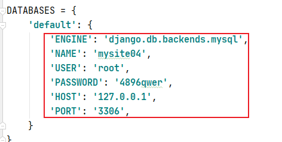
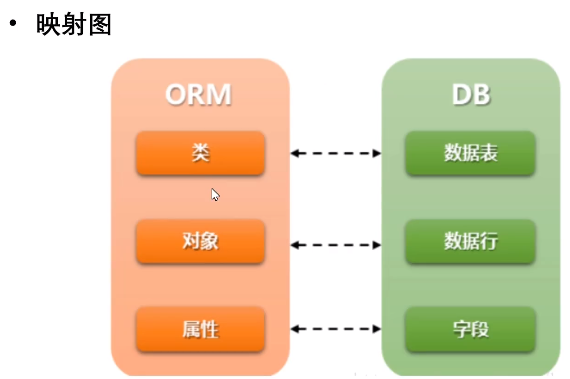

> 模型层（Model）
>
> 模型层-负责跟数据库之间通信

## Django配置mysql

> 安装mysqlcilent（版本mysqlcilent 1.3.13以上）
>
> 直接pip安装不了，需要先去官网（https://www.lfd.uci.edu/~gohlke/pythonlibs/#mysqlclient）
>
> 下载之后需要下载VC++（https://support.microsoft.com/zh-cn/help/2977003/the-latest-supported-visual-c-downloads）
>
> 然后cd到mysqlclient所在目录pip install 包名就可以了

1. 创建数据库
2. 在mysql数据库 执行

```python
create database 数据库名 default charset=utf8;
通常数据库名和项目名保持一致
```

3. setting.py里进行数据库的配置



## 模型

> 模型是一个Python类，它是由**django.db.models.Model类派生出的子类一个模型类代表数据库中的一张数据表**

> **模型类中每一个类属性都代表数据库中的一个字段**
>
> **模型是数据交互的接口，是表示和操作数据库的方法和方式（就可以不再使用SQL语句）**

## ORM框架

> 定义：ORM即对象关系映射，它是一种程序设计，它运行你使用类和对象对数据库进行操作，从而避免通过SQL语句操作数据库

> 作用：建立模型和表之间的对应关系，允许我们通过面向对象的方式操作数据库根据设计的模型类生成数据库中的表格

通过简单的配置就可以进行数据库的切换



### 模型类-创建

```python
from django.db import models
class 模型类名(models.Model):
    字段名 = models.字段类型(字段选项)
```

模型实例：

```python
创建一个book应用
py manage.py startapp bookstore
在主目录setting.py注册app
在应用目录下定义模型
#models.py
from django.db import models

class book(models.Model):#这里必须继承models.Model
    title = models.CharField('书名', max_length=50, default='')
    #max_digits代表总位数，decimal_places代表小数位数
    price = models.DecimalField('价格', max_digits=7, decimal_places=2)
#如果在定下模型类的时候没有指定主键，那么django就会自动生成id主键
```

> 只要在models文件里面修改了就需要更新表结构：
>
> 执行数据库迁移
>
> 迁移是Django同步你对模型所做更改到你的数据库模式的方式

```python
#生成迁移文件，将应用下的models.py文件生成一个中间文件，并保持在migrations文件夹中
py manage.py makemigrations
#执行迁移脚本程序，执行迁移程序实现迁移，将每个应用下的migrations目录中的中间文件同步回数据库
py manage.py migrate
```

```python
如果在迁移的时候报错django.db.utils.OperationalError: (2059, <NULL>)
就是因为mysql8.0的加密方式导致的需要：
mysql -u root -p  登录mysql，连接用户为root
use mysql;
select user,plugin from user where user='root';执行命令查看加密方式
alter user 'root'@'localhost' identified with mysql_native_password by 'yourpassword'执行命令修改加密方式
重启即可
```

### 模型类-字段类型

```python
BooleanField()
数据库类型：tinyint(1)
编程语言中：使用True和False来标示值
在数据库中：使用1和0表示值
```

```python
CharField()
数据库类型：varchar
注意：必须要指定max_length值
```

```python
DataField()
数据库类型：date
表示日期
参数：
auto_now：每次保存对象时，自动设置该字段为当前时间（取值：True/False）
auto_now_add：当对象第一次被创建时字段设置当前时间（取值：True/False）
default：设置当前时间（取值：字符串格式时间）
以上参数三选一
```

```python
FloatField()
数据库类型：double
编程语言中和数据库中都使用小数表示值
```

```python
EmailField()
数据库类型：varchar
当输入格式不是Email格式的时候会报错
```

```python
IntegerField()
数据库类型：int
编程语言和数据库中使用整数
```

```python
ImageField()
数据库类型：varchar(100)
作用：在数据库中为了保存图片的路径##不是图片的内容
```

```python
TextField()
数据库类型：longtext
作用：表示不定长的字符数据（不用指定长度）
```

更多模型字段查看(https://docs.djangoproject.com/zh-hans/3.2/ref/models/fields/)

### 模型类-字段选项

字段选项，指定创建的列的额外的信息运行多个字段选项，用，隔开

```python
from django.db import models
class 模型类名(models.Model):
    字段名= models.字段类型(字段选项)
```

```python
#primary_key
如果设置为True，表示该列为主键，则此数据库就不会自动生成id字段了
```

```python
#blank
设置为True时，字段可以为空，设置为False时，字段是必须填写的
```

```python
#null
如果设置为True，表示该列值允许为空
默认为False，如果此选项为False建议加入default选项来设置默认值
```

```python
#default
设置所有列的默认值，如果字段选项null=false建议添加此项
```

```python
#db_index
如果这是为True，表示为该列增加索引
```

```python
#unique
如果设置为True，表示该字段在数据库中的值必须是唯一，不能出现重复
```

```python
实例
name = models.CharField(max_length=20,default='',unique=True,null=False)
```

> **如果在models文件里面添加了这些字段选项都要更新数据库接口makemigrations**

更多字段选项（https://docs.djangoproject.com/zh-hans/3.2/ref/models/fields/#field-options）

### 模型类-Meta类

> 使用内部Meta类来给模型赋予属性，Meta类下面有很多内建的类属性，可对模型类进行一些控制

```python
实例
from django.db import models
class book(models.Model):
    name = models.CharField('名字', max_length=8)
    class Meta:
        db_table = 'books'  #更改当前模型类对应的表名，在数据库中模型类的名字就被更改为books了
```

Meta类是定义在模型类里边的，用于修改一些模型类的属性更多Meta类选项参考官网

### Meta类-补充

通过Meta内嵌类，定义模型类的属性

```python
class book(models.Model):
    db_table = '数据表名' 
    verbose_name = '显示单数名'   用于显示在admin管理界面中
    verbose_name_plural = verbose_name  #显示复数名   用于显示在admin管理界面中
```

