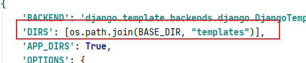

> Django 模板的应用，模板是一个文本，用于分离文档的表现形式和内容

## 模板应用实例

将在`HelloWorld` 目录底下创建 `templates` 目录并建立 `runoob.html`文件，整个目录结构如下

```python
HelloWorld/
|-- HelloWorld
|   |-- __init__.py
|   |-- __init__.pyc
|   |-- settings.py
|   |-- settings.pyc
|   |-- urls.py
|   |-- urls.pyc
|   |-- views.py
|   |-- views.pyc
|   |-- wsgi.py
|   `-- wsgi.pyc
|-- manage.py
`-- templates
    `-- runoob.html
```

```html
#runoob.html
<h1>{{ hello }}</h1>
```

接下来我们需要向Django说明模板文件的路径，修改`HelloWorld/settings.py`，修改 `TEMPLATES` 中的 `DIRS` 为 `[os.path.join(BASE_DIR, 'templates')]`



我们现在修改` views.py`，增加一个新的对象，用于向模板提交数据：

```python
#views.py
from django.shortcuts import render 
def runoob(request):
     context = {}
     context['hello'] = 'Hello World!'
     return render(request, 'runoob.html', context)
#urls.py
from django.urls import path 
from . import views 

urlpatterns = [ path('runoob/', views.runoob), ]
```

我们现在修改 `views.py`，增加一个新的对象，用于向可以看到，我们这里使用 render 来替代之前使用的

`HttpResponse`。render 还使用了一个字典 context 作为参数。

context 字典中元素的键值 hello 对应了模板中的变量 {{ hello }}模板提交数据：

```html
#网页输出
hello world
```

---

## Django模板标签

### 变量

> 模板语法：

```python
view：｛"HTML变量名" : "views变量名"｝
HTML：｛｛变量名｝｝
```

```python
#views.py
from django.shortcuts import render

def runoob(request):
  views_name = "菜鸟教程"
  return  render(request,"runoob.html", {"name":views_name})
#runoob_2.html
<p>{{ name }}</p>
#网页输出
菜鸟教程
```

### 列表

> templates 中的` runoob.html`中，可以用 . 索引下标取出对应的元素

```python
#views.py
def runoob_2(request):
    views_list = ['列表1','列表2','列表3']
    return render(request, "runoob_2.html", {"views_list":views_list})
#runoob_2.html
<p>{{ views_list }}</p> # 取出整个列表 
<p>{{ views_list.0 }}</p> # 取出列表的第一个元素
#网页输出
['列表1', '列表2', '列表3']
列表1
```

### 字典

> templates 中的` runoob.html`中，可以用 .键 取出对应的值

```python
#views.py
def runoob_3(request):
    views_dict = {"name":"alex"}
    return render(request, "runoob_3.html", {"views_dict": views_dict})
#runoob_3.html
<p>{{ views_dict }}</p>
<p>{{ views_dict.name }}</p>
#网页输出
{'name': 'alex'}
alex
```

---

## 过滤器

> 模板语法：

```
{{ 变量名 | 过滤器：可选参数 }}
```

模板过滤器可以在变量被显示前修改它，过滤器使用**管道字符**，如下所示

```
{{ name|lower }}
```

> {{ name }} 变量被过滤器 lower 处理后，文档大写转换文本为小写。

过滤管道可以被* 套接* ，既是说，一个过滤器管道的输出又可以作为下一个管道的输入：

```
{{ my_list|first|upper }}
以上实例将第一个元素并将其转化为大写
```

以上实例将第一个元素并将其转化为大写有些过滤器有参数。 过滤器的参数跟随冒号之后并且总是以双引号包含。 例如

```
{{ bio|truncatewords:"30" }}
这个将显示变量 bio 的前30个词
```

### 其他过滤器

* addslashes : 添加反斜杠到任何反斜杠、单引号或者双引号前面
* date : 按指定的格式字符串参数格式化 date 或者 datetime 对象，实例：

```
{{ pub_date|date:"F j, Y" }}
```

* length : 返回变量的长度

### default

> default 为变量提供一个默认值,如果 views 传的变量的布尔值是 false，则使用指定的默认值

```
以下值为 false：
0  0.0  False  0j  ""  []  ()  set()  {}  None
```

```python
#views.py
def runoob_4(request):
    name = 0
    return render(request, 'runoob_4.html', {'name':name})
#runoob_4.html
{{ name|default:"菜鸟教程"}}
#网页输出
菜鸟教程
```

### length

> 返回对象的长度，适用于字符串和列表，字典返回的是键值对的数量，集合返回的是去重后的长度

```python
#views.py
def runoob_5(request):
    name="菜鸟教程"
    return render(request, "runoob_5.html", {"name":name})
#runoob_5.html
{{ name|length }}
#网页输出
4
```

### filesizeformat

> 以更易读的方式显示文件的大小（即'13 KB', '4.1 MB', '102 bytes'等）,字典返回的是键值对的数量，集合返回的是去重后的长度

```python
#views.py
def runoob_6(request):
    num = 100
    return render(request, "runoob_6.html", {"num":num})
#runoob_6.html
{{ num|filesizeformat}}
#网页输出
100 bytes
```

### date

> 根据给定格式对一个日期变量进行格式化,格式 Y-m-d H:i:s返回 年-月-日 小时:分钟:秒 的格式时间

```python
#views.py
def runoob_7(request):
    import datetime
    now = datetime.datetime.now()
    return render(request, 'runoob_7.html', {"time":now})
#runoob_7.html
{{ time|date:"Y-m-d"}}
#网页输出
2021-05-27
```

### truncatechars

> 如果字符串包含的字符总个数多于指定的字符数量，那么会被截断掉后面的部分,截断的字符串将以**... 结尾**

```python
#views.py
def runoob_8(request):
    str = "菜鸟教程"
    return render(request, "runoob_8.html", {"str":str})
#runoob_8.html
{{ str|truncatechars:2}}
#网页输出
菜…
```

### safe

将字符串标记为安全，不需要转义。要保证 views.py 传过来的数据绝对安全，才能用 safe。

和后端 views.py 的 mark_safe 效果相同。

Django 会自动对 views.py 传到HTML文件中的标签语法进行转义，令其语义失效。加 safe 过滤器是告诉 Django 该数据是安全的，不必对其进行转义，可以让该数据语义生效。

```python
#views.py
def runoob_9(request):
    str = "<a href='https://www.baidu.com/'>点击跳转百度</a>"
    return render(request, "runoob_9.html", {'str':str})
#runoob_9.html
{{ str|safe }}
#网页输出
点击跳转百度 (点击之后就会跳转百度)
```

### if/else 标签

```python
基本语法格式

     ... display

或者

   ... display 1

   ... display 2

   ... display 3

```

> **if/else 支持嵌套 标签接受 and ， or 或者 not 关键字来对多个变量做判断 ，或者对变量取反（ not )**

```python
#views.py
def runoob_10(request):
    num = 90
    return render(request, "runoob_10.html", {'num':num})
#runoob_10.html

优秀

合格

不及格

#网页输出
合格
```

---

## 注释标签

> Django 注释使用 {# #}

```
{# 这是一个注释 #}
```

----

## include 标签

>  标签允许在模板中包含其它的模板的内容。下面这个例子都包含了 nav.html 模板

```

```

---

## **csrf_token**

> csrf_token 用于form表单中，作用是跨站请求伪造保护。如果不用｛% csrf_token %｝标签，在用 form 表单时，要再次跳转页面会报403权限错误。

> 用了｛% csrf_token %｝标签，在 form 表单提交数据时，才会成功。

> 解析：
>
> 首先，向服务器发送请求，获取登录页面，此时中间件 csrf 会自动生成一个隐藏input标签，该标签里的 value 属性的值是一个随机的字符串，用户获取到登录页面的同时也获取到了这个隐藏的input标签。然后，等用户需要用到form表单提交数据的时候，会携带这个 input 标签一起提交给中间件 csrf，原因是 form 表单提交数据时，会包括所有的 input 标签，中间件 csrf 接收到数据时，会判断，这个随机字符串是不是第一次它发给用户的那个，如果是，则数据提交成功，如果不是，则返回403权限错误

---

## 模板继承

> 模板可以用继承的方式来实现复用，减少冗余内容。
>
> 网页的头部和尾部内容一般都是一致的，我们就可以通过模板继承来实现复用。
>
> 父模板用于放置可重复利用的内容，子模板继承父模板的内容，并放置自己的内容

---

## 父模板

> **标签 block...endblock: 父模板中的预留区域，该区域留给子模板填充差异性的内容，不同预留区域名字不能相同**

```

预留给子模板的区域，可以设置设置默认内容

```

---

## 子模板

> 子模板使用标签 extends 继承父模板：

```

```

```
子模板如果没有设置父模板预留区域的内容，则使用在父模板设置的默认内容，当然也可以都不设置，就为空。
子模板设置父模板预留区域的内容：
{ % block 名称 % }
内容

```

接下来我们先创建之前项目的 templates 目录中添加 base.html 文件

```html
#base.html
<!DOCTYPE html>
<html>
<head>
<meta charset="utf-8">
<title>菜鸟教程(runoob.com)</title>
</head>
<body>
    <h1>Hello World!</h1>
    <p>菜鸟教程 Django 测试。</p>
    
       <p>original</p>
    
</body>
</html>
以上代码中，名为 mainbody 的 block 标签是可以被继承者们替换掉的部分
所有的  标签告诉模板引擎，子模板可以重载这些部分
```

```html
runoob.html 中继承 base.html，并替换特定 block，runoob.html 修改后的代码如下
#runoob_12.html

{{ name }}

<p>继承了base.html 文件</p>

```

```python
#views.py
def runoob_12(request):
    name = "菜鸟教程"
    return render(request, "runoob_12.html", {"name":name})
#网页输出
Hello World!
菜鸟教程 Django 测试。
继承了base.html 文件
```

