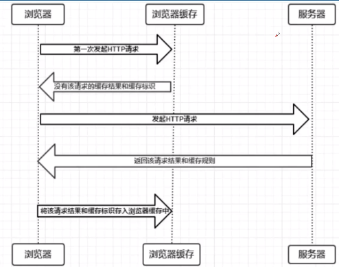

## 缓存的定义

> 定义：缓存是一类可以**更快的读取数据的介质统称**，也指其他可以加上数据读取的存储方式，一般用来**存储临时数据**，**常用介质的是读取速度很快的内存**

> 意义：**视图渲染有一定成本**，数据库的频繁查询过高；所有对于**低频变动的页面**可以考虑使用**缓冲技术**，减少实际渲染次数；**用户拿到响应的时间成本会更低**

缓冲常见

缓存的地方，数据变动频率较少的地方可以使用缓存，如：电商商品详情页，博客列表页

## 缓存配置

### django中设置缓存-数据库缓存

将缓存的数据存储在您的数据库中

> 说明：**尽管存储介质没有更换，但是当把每一次赋值查询的结果直接存储到表里，比如多个条件的过滤查询结果，可避免重复进行复杂查询，提升效率**

```python
配置
CACHES = {
    'default':{
        'BACKEND': 'django.core.cache.backends.db.DatabaseCache',#配置数据库
        'LOCATION': '数据库表名',#数据库里面的数据表名
        'TIMEOUT': 300,#缓存保存时间 单位秒，默认值为300
        'OPTIONS':{  #可选项
            'MAX_ENTRIES':300, #缓存最大数据条数，超过这个数值就执行下面操作
            'CULL_FREQUENCY': xx,#缓存条数达到最大值时，删除xx分之一的缓存数据
        }
    }
}
#如果还有其他缓存，就直接安装default的格式直接加，和default平级
```

本地内存缓存（不推荐）

文件系统缓存（不推荐）

## 整体缓存策略

> 相当于把视图函数里的响应一股脑的放在缓存存储区

```python
方法1：在视图函数中设置
from django.views.decorators.cache import cache_page  #导入包
from django.http import HttpResponse
import time

@cache_page(5)  #装饰器  时间单位秒 在缓存中的存储时间
def my_view(request):
    t = time.time()
    return HttpResponse('%s'%(t))
```

```python
方法2：在路由中设置
from django.contrib import admin
from django.urls import path
from . import views
from django.views.decorators.cache import cache_page  #导入包

urlpatterns = [
    path('admin/', admin.site.urls),
    path('cache', views.my_view),
    path('cache_2', cache_page(5)(views.my_view_2)),
]
```

## 局部缓存策略

> **比整体缓存复用性更强**

缓存api的使用

```python
先引入cache对象
    方式1：使用caches['CACHE配置key']导入具体对象
    from django.core.cache import caches
    cache1 = caches['myalias']
    cache2 = caches['myalias_2']
    方式2：
    在CACHE配置项只有default一项的时候就可以使用这个
    from django.core.cache import cache 
    相当于直接引入CACHES配置项中的‘default’项
```

```python
1.cache.set(key, value, timeout)-存储缓存
key:缓存的key，字符串类型
value:Python对象
timeout:缓存存储时间(s),默认为CACHES中的TIMEOUT值
返回值:None
2.cache.get(key) -获取缓存
key:缓存的key
返回值：为key的具体值，如果没有数据，则返回None
3.cache.add(key, value) - 存储缓存，只在key不存在时生效
返回值:True[存储成功] or False[存储失败]
4.cache.get_or_set(key, value, timeout)-如果没有获取到数据，则执行set操作
返回值：value
5.cache.set_many(dict,timeout) -批量存储缓存
dict: key和value的字典
timeout：存储时间(s)
返回值：插入不成功的key的数组
6.cache.get_many(key_list) -批量获取缓存数据
key_list:包含key的数组
返回值：取到的key和value的字典
7.cache.delete(key) -删除key的缓存数据
返回值:None
8.cache.delete_many(key_list) - 批量删除
返回值：None
```

## 浏览器缓存策略

> 浏览器缓存定义：指的就是浏览器下一次再请求的时候直接从浏览器本地拿数据，不必再去服务器拿数据，相当于就是存在本地的磁盘上



### 浏览器缓存-强缓存

> 不向服务器发送请求，直接从缓存中读取数据

```python
1.响应头-Expires
定义：缓存过期时间，用来指定资源到期的时间，是服务端的具体时间点
样例：Expires:Thu, 02 Apr 2030 05:14:08 GMT
2.响应头-Cache-Control
在HTTP/1.1中，Cache-Control主要用于控制网页缓存。比如'Cache-Control:max-age=120'代表请求创建时间后的120秒，缓存失效
说明：目前服务器都会带着这两个头同时响应给浏览器，浏览器优先使用Cache-Control
一般情况下两个都会给服务器
```

### 协商缓存

> 强缓存中的数据**一旦过期**，还需要跟服务器进行通信，从而获取最新数据；（**协商缓存是针对大文件如：图片，视频，因为每次都去拿大文件是非常浪费带宽的**）

```python
1.Last-Modified响应头 和if-Modified-Since请求头
说明：
    1.Last-Modified为文件的最近修改时间，浏览器第一次请求静态文件时，服务器如果返回Last-Modified响应头，则代表该资源为需要协商的缓存
    2.当缓存到期后，浏览器获取到的Last-Modified值作为请求头if-Modified-Since的值，与服务器发请求协商，服务端返回304响应码[响应体为空]，代表缓存继续使用，200响应码代表缓存不可用[响应体为最新资源]
2.Etag响应头和if-None-Match请求头
说明：
    1.Etag是服务器响应请求时，返回当前资源文件的一个唯一标识（由服务器生成如哈希值），只要资源有变化，Etag就会重新生成；
    2.缓存到期后，浏览器将Etag响应头的值作为if-None-Match请求头的值，给服务器发请求协商；服务器接到请求头后，比对文件标识，不一致则认为资源不可用，返回200响应码[响应体为最新资源];可用则返回304响应码
（应用场景：需要返回精确的时候用Etag）
```

