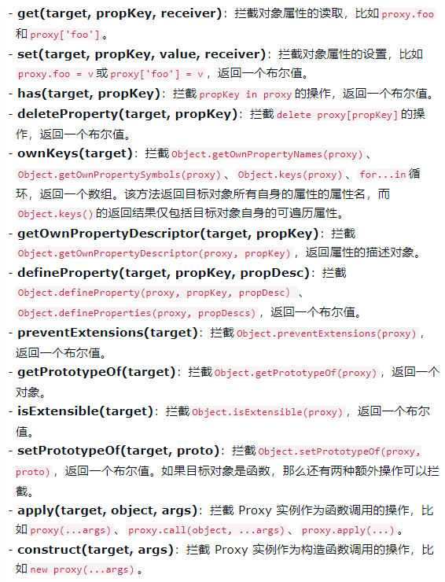

#### 概述

> Proxy 用于**修改某些操作的默认行为**，等同于在**语言层面做出修改**，所以属于一种“**元编程**”（meta programming），即**对编程语言进行编程**

> Proxy 可以理解成，在**目标对象之前架设一层“拦截”**，**外界**对该对象的**访问**，都必须先通过这层**拦截**，因此提供了**一种机制**，可以**对外界的访问进行过滤和改写**。Proxy 这个词的原意是**代理**，用在这里表示由它来“代理”某些操作，**可以译为“代理器”**

```javascript
var obj = new Proxy({}, {
  get: function (target, propKey, receiver) {
    console.log(`getting ${propKey}!`);
    return Reflect.get(target, propKey, receiver);
  },
  set: function (target, propKey, value, receiver) {
    console.log(`setting ${propKey}!`);
    return Reflect.set(target, propKey, value, receiver);
  }
});
//上面代码对一个空对象架设了一层拦截，重定义了属性的读取（get）和设置（set）行为。这里暂时先不解释具体的语法，只看运行结果。对设置了拦截行为的对象obj，去读写它的属性，就会得到下面的结果
obj.count = 1
//  setting count!
++obj.count
//  getting count!
//  setting count!
//  2
```

> 上面代码说明，Proxy 实际上**重载（overload）了点运算符**，即用**自己的定义覆盖了语言的原始定义**

> ES6 原生**提供 Proxy 构造函数**，用来**生成 Proxy 实例**

```javascript
var proxy = new Proxy(target, handler);
```

> Proxy 对象的**所有用法**，**都是上面这种形式**，**不同**的只是`handler`参数的写法。其中，`new Proxy()`表示生成一个`Proxy`实例，`target`参数表示**所要拦截的目标对象**，`handler`参数**也是一个对象，用来定制拦截行为**

> 下面是另一个拦截读取属性行为的例子

```javascript
var proxy = new Proxy({}, {
  get: function(target, propKey) {
    return 35;
  }
});

proxy.time // 35
proxy.name // 35
proxy.title // 35

//上面代码中，作为构造函数，Proxy接受两个参数。第一个参数是所要代理的目标对象（上例是一个空对象），即如果没有Proxy的介入，操作原来要访问的就是这个对象；第二个参数是一个配置对象，对于每一个被代理的操作，需要提供一个对应的处理函数，该函数将拦截对应的操作。比如，上面代码中，配置对象有一个get方法，用来拦截对目标对象属性的访问请求。get方法的两个参数分别是目标对象和所要访问的属性。可以看到，由于拦截函数总是返回35，所以访问任何属性都得到35
```

> **注意**，要使得`Proxy`**起作用**，**必须针对**`Proxy`**实例**（上例是`proxy`对象）**进行操作**，而**不是针对目标对象**（上例是空对象）进行**操作**

> 如果`handler`没有**设置任何拦截**，那就等同于**直接通向原对象**

```javascript
var target = {};
var handler = {};
var proxy = new Proxy(target, handler);
proxy.a = 'b';
target.a // "b"
//上面代码中，handler是一个空对象，没有任何拦截效果，访问proxy就等同于访问target
```

> **一个技巧是将 Proxy 对象**，**设置到`object.proxy`属性**，从而可以在`object`**对象上调用**

```javascript
var object = { proxy: new Proxy(target, handler) };
```

> Proxy 实例**也可以作为其他对象的原型对象**

```javascript
let proxy = new Proxy({},{
    get: function (target, propKey) {
        return 10;
    },
});
let obj = Object.create(proxy);
console.log(obj.time);//10
//上面代码中，proxy对象是obj对象的原型，obj对象本身并没有time属性，所以根据原型链，会在proxy对象上读取该属性，导致被拦截
```

> **同一个**拦截器函数，可以设置**拦截多个操作**

```javascript
var handler = {
  get: function(target, name) {
    if (name === 'prototype') {
      return Object.prototype;
    }
    return 'Hello, ' + name;
  },

  apply: function(target, thisBinding, args) {
    return args[0];
  },

  construct: function(target, args) {
    return {value: args[1]};
  }
};

var fproxy = new Proxy(function(x, y) {
  return x + y;
}, handler);

fproxy(1, 2) // 1
new fproxy(1, 2) // {value: 2}
fproxy.prototype === Object.prototype // true
fproxy.foo === "Hello, foo" // true
```

> 对于**可以设置、但没有设置拦截的操作**，则**直接落在目标对象上**，按照**原先的方式产生结果**

> 下面是 Proxy **支持的拦截操作**一览**，一共 13 种**



#### Proxy实例的方法

##### get()

> `get`方法用于**拦截某个属性的读取操作**，可以接受**三个参数**，依次为**目标对象**、属性名和 **proxy 实例本身**（严格地说，是**操作行为所针对的对象**），其中**最后一个参数可选**

> 下面是另一个拦截读取操作的例子

```javascript
var person = {
  name: "张三"
};

var proxy = new Proxy(person, {
  get: function(target, propKey) {
    if (propKey in target) {
      return target[propKey];
    } else {
      throw new ReferenceError("Prop name \"" + propKey + "\" does not exist.");
    }
  }
});

proxy.name // "张三"
proxy.age // 抛出一个错误
//上面代码表示，如果访问目标对象不存在的属性，会抛出一个错误。如果没有这个拦截函数，访问不存在的属性，只会返回undefined
```

> `get`方法**可以继承**

```javascript
let proto = new Proxy({}, {
  get(target, propertyKey, receiver) {
    console.log('GET ' + propertyKey);
    return target[propertyKey];
  }
});

let obj = Object.create(proto);
obj.foo // "GET foo"
//上面代码中，拦截操作定义在Prototype对象上面，所以如果读取obj对象继承的属性时，拦截会生效
```

