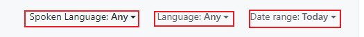

> 寻找开源项目

1. https://github.com/trending

2. 《HelloGitHub》周刊https://github.com/521xueweihan/HelloGitHub
3. 掘金https://juejin.cn/

> 直接在Github搜索

* awesome  xxx
* 找例子 xxx sample
* 找项目空架子 xxx starter / xxx boilerplate
* 找教程 xxx tutorial

