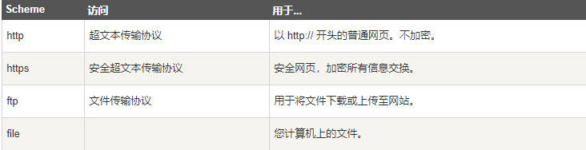
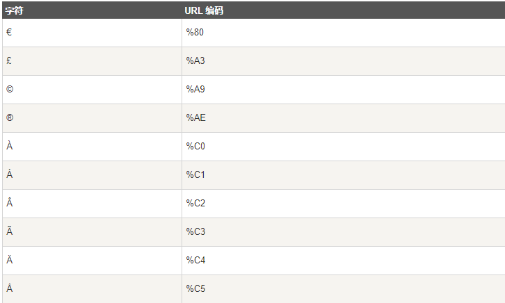

## HTML 统一资源定位器(Uniform Resource Locators)

> URL 是一个网页地址 或互联网协议（IP）地址

## URL - 统一资源定位器

> Web浏览器通过URL从Web服务器请求页面

> 当您点击 HTML 页面中的某个链接时，对应的 <a> 标签指向万维网上的一个地址

> 一个统一资源定位器(URL) 用于定位万维网上的文档

语法规则

```html
scheme://host.domain:port/path/filename
scheme - 定义因特网服务的类型。最常见的类型是 http
host - 定义域主机（http 的默认主机是 www）
domain - 定义因特网域名，比如 runoob.com
port - 定义主机上的端口号（http 的默认端口号是 80）
path - 定义服务器上的路径（如果省略，则文档必须位于网站的根目录中）
filename - 定义文档/资源的名称
```

## 常见的 URL Scheme



## URL 字符编码

> URL 只能使用 **ASCII 字符集.**

> 来通过因特网进行发送。由于 URL 常常会包含 ASCII 集合之外的字符，URL 必须转换为有效的 ASCII 格式

> URL **编码使用 "%" 其后跟随两位的十六进制数**来替换**非 ASCII 字符**
>
> **URL 不能包含空格。URL 编码通常使用 + 来替换空格**

## URL 编码实例



