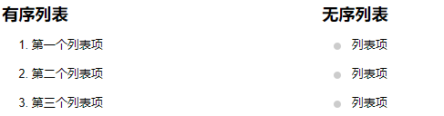
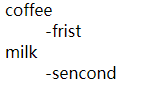
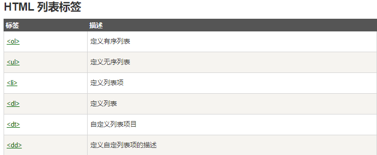

> HTML 支持有序、无序和定义列表



## HTML无序列表

> 无序列表使用 `<ul> `标签

```html
<ul>
      <li>frist</li>
      <li>sencod</li>
</ul>
```

## HTML 有序列表

>  有序列表使用` <ol>` 标签

```html
<ol>
      <li>frist</li>
      <li>sencod</li>
</ol>
```

## HTML 自定义列表

> 自定义列表以 <dl> 标签开始。每个自定义列表项以 <dt> 开始。每个自定义列表项的定义以 <dd> 开始

```html
<dl>
   <dt>coffee</dt>
   <dd>-frist</dd>  #这个-是可以自定义的
   <dt>milk</dt>
   <dd>-sencond</dd> #这个-是可以自定义的
</dl>
```



## 注意事项 - 有用提示

> **提示: 列表项内部可以使用段落、换行符、图片、链接以及其他列表等等**



