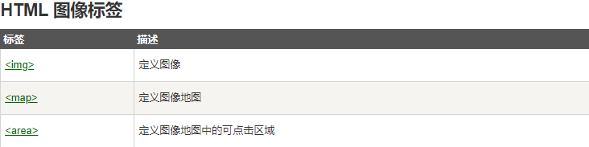

## HTML 图像- 图像标签（` `）和源属性（Src）

> 在 HTML 中，图像由 标签定义。

> ** 是空标签**，意思是说，它只包含属性，并且**没有闭合标签**。

> 要在页面上显示图像，你需要使用源属性（src）。src 指 "source"。**源属性的值是图像的 URL 地址**

```html

```

## HTML 图像- Alt属性

> alt 属性用来为图像定义一串预备的可替换的文本。

> 替换文本属性的值是用户定义的

```html

```

> 在浏览器无法加载出图像时，alt的作用就是提示用户加载失败了，此时，浏览器将显示这个替代性的数据。**为页面上的图像都加上替换文本属性是个好习惯**

## HTML 图像- 设置图像的高度与宽度

> **height（高度） 与 width（宽度）**属性用于设置图像的高度与宽度。

> **属性值默认单位为像素:**

```html

```

> 提示: 指定图像的高度和宽度是一个很好的习惯。如果图像指定了高度宽度，页面加载时就会保留指定的尺寸。**如果没有指定图片的大小，加载页面时有可能会破坏HTML页面的整体布局**

## 基本的注意事项 - 有用的提示

> 注意: 假如某个 HTML 文件包含十个图像，那么为了正确显示这个页面，需要加载 11 个文件。加载图片是需要时间的，所以我们的建议是：**慎用图片**

> 注意: 加载页面时，要注意插入页面图像的路径，如果不能正确设置图像的位置，浏览器无法加载图片，图像标签就会显示一个破碎的图片



