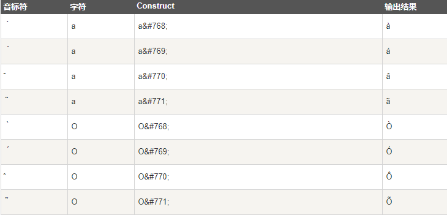
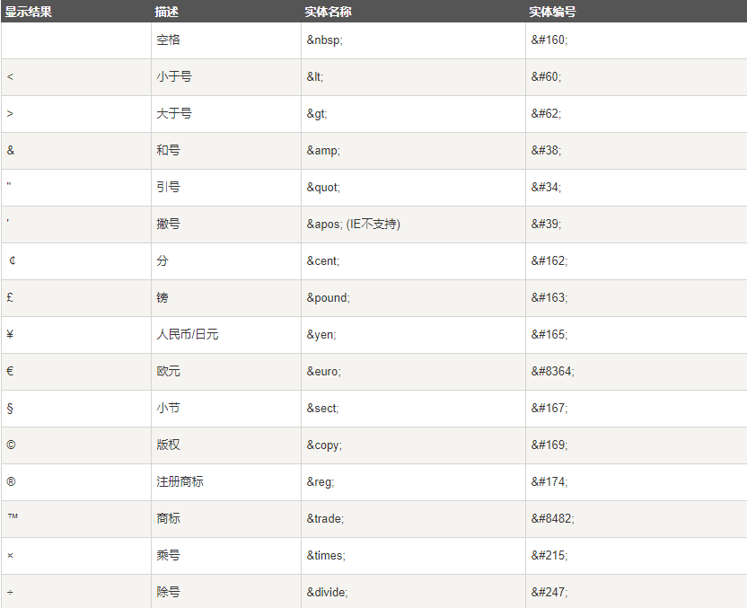

> HTML 中的**预留字符必须被替换为字符实体**

> 一些在**键盘上找不到的字符**也可以**使用字符实体来替换**

## HTML 实体

> 在 HTML 中，**某些字符是预留的**
>
> 在 HTML 中**不能使用小于号（<）和大于号（>）**，这是因为浏览器会**误认为它们是标签**

> 如果希望正确地显示预留字符，我们必须在 HTML 源代码中使用字符实体（character entities）

## 不间断空格(Non-breaking Space)

> HTML 中的常用字符实体是**不间断空格(`&nbsp;`)**

> 浏览器会截短HTML页面中的空格，如果有10个空格，那么浏览器会删除9个，如需要增加空格，使用 `&nbsp;`

## 结合音标符

> 一些变音符号, 如 尖音符 ( ̀) 和 抑音符 ( ́)

## HTML字符实体

> **实体名称对大小写敏感**

