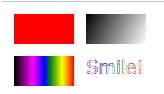

> `<canvas>` 标签定义图形，比如图表和其他图像，您必须使用脚本来绘制图形在画布上（Canvas）画一个红色矩形，渐变矩形，彩色矩形，和一些彩色的文字

> HTML5 <canvas> **元素用于图形的绘制**，**通过脚本 (通常是JavaScript)来完成**
>
> `<canvas> `标签只是图形容器，您必须使用脚本来绘制图形

你可以通过多种方法使用 canvas 绘制路径,盒、圆、字符以及添加图像

(后面的内容需要用到java script)

