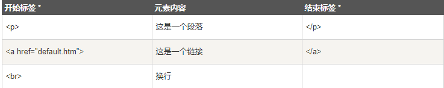

> HTML 文档由 HTML 元素定义

## HTML元素



## HTML元素语法

```html
HTML 元素以开始标签起始
HTML 元素以结束标签终止
元素的内容是开始标签与结束标签之间的内容
某些 HTML 元素具有空内容（empty content）
空元素在开始标签中进行关闭（以开始标签的结束而结束）
大多数 HTML 元素可拥有属性
```

## 嵌套的HTML元素

> 大多数 HTML 元素可以嵌套（HTML 元素可以包含其他 HTML 元素）。HTML 文档由相互嵌套的 HTML 元素构成

## HTML空元素

```html
没有内容的 HTML 元素被称为空元素。空元素是在开始标签中关闭的。

就是没有关闭标签的空元素（
标签定义换行）。
在 XHTML、XML 以及未来版本的 HTML 中，所有元素都必须被关闭。
在开始标签中添加斜杠，比如 <br />，是关闭空元素的正确方法，HTML、XHTML 和 XML 都接受这种方式。
即使
在所有浏览器中都是有效的，但使用 <br /> 其实是更长远的保障
```

