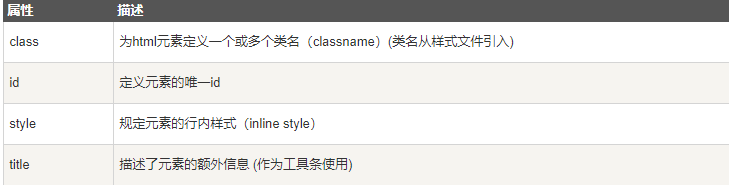

属性是 HTML 元素提供的附加信息

## HTML属性

```html
HTML 元素可以设置属性
属性可以在元素中添加附加信息
属性一般描述于开始标签
属性总是以名称/值对的形式出现，比如：name="value"
```

## HTML 属性常用引用属性值

```html
属性值应该始终被包括在引号内。双引号是最常用的，不过使用单引号也没有问题。在某些个别的情况下，比如属性值本身就含有双引号，那么您必须使用单引号，例如：name='John "ShotGun" Nelson'
```

> **HTML 提示：使用小写属性**

HTML属性参考



更多标签<https://www.runoob.com/tags/html-reference.html>

```html
属性和属性值，尽量小写，本来这样做也方便些。class 属性可以多用 class=" " （引号里面可以填入多个class属性）id 属性只能单独设置 id=" "（只能填写一个，多个无效）
```

