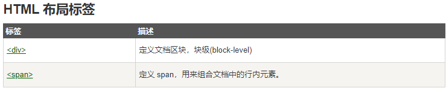

> 网页布局对改善网站的外观非常重要。
>
> 请慎重设计您的网页布局

## 网站布局

> 虽然我们可以使用HTML table标签来设计出漂亮的布局，但是table标签是不建议作为布局工具使用的 - 表格不是布局工具,**尽量使用div**

## HTML 布局 - 使用`
 `元素

> div 元素是用于分组 HTML 元素的块级元素

## HTML 布局 - 有用的提示

> **使用 CSS 最大的好处是，如果把 CSS 代码存放到外部样式表中，那么站点会更易于维护。通过编辑单一的文件，就可以改变所有页面的布局**

由于创建高级的布局非常耗时，使用模板是一个快速的选项。通过搜索引擎可以找到很多免费的网站模板（您可以使用这些预先构建好的网站布局，并优化它们）

