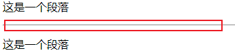

> 在 HTML 文档中，标题很重要

## HTML标题

> 标题（Heading）是通过 <h1> - <h6> 标签进行定义的。

> **<h1> 定义最大的标题。 <h6> 定义最小的标题**

```html
注释: 浏览器会自动地在标题的前后添加空行
```

## HTML水平线

> `<hr> `标签在 HTML 页面中创建水平线，hr 元素可用于分隔内容

```html
<p>这是一个段落</p>
<hr>
<p>这是一个段落</p>
```



## HTML注释

```html
<!--注释-->
```

