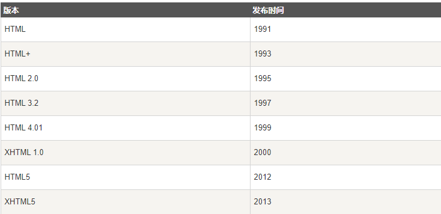

> 超文本标记语言（HyperText Markup Language）是一种用于创建网页的标准标记语言

```python
HTML文档后缀名
.html
.htm
```

> *注意：对于中文网页需要使用 <meta charset="utf-8"> 声明编码，否则会出现乱码。有些浏览器(如 360 浏览器)会设置 GBK 为默认编码，则你需要设置为 <meta charset="gbk">*

## HTML标签

HTML 标记标签通常被称为 HTML 标签 (HTML tag)

* HTML 标签是由尖括号包围的关键词，比如 <html>
* **HTML 标签通常是成对出现的，比如` <b>` 和` </b>`**
* 标签对中的第一个标签是开始标签，第二个标签是结束标签
* 开始和结束标签也被称为开放标签和闭合标签

```html
<标签>内容<标签>
```

## 实例

```html
<!DOCTYPE html>
<html>
<head>
<meta charset="utf-8">
<title>菜鸟教程(runoob.com)</title>
</head>
<body>
<h1>我的第一个标题</h1>
<p>我的第一个段落。</p>
</body>
</html>
```

* `<!DOCTYPE html> `声明为 HTML5 文档，这个必须声明
* `<html> `元素是 HTML 页面的根元素
* `<head>` 元素包含了文档的元（meta）数据，如 `<meta charset="utf-8"> `定义网页编码格式为 utf-8，**这个也必须声明**
* `<title> `元素描述了文档的标题
* `<body>` 元素包含了可见的页面内容
* `<h1> `元素定义一个大标题
* `<p>` 元素定义一个段落

## HTML版本



