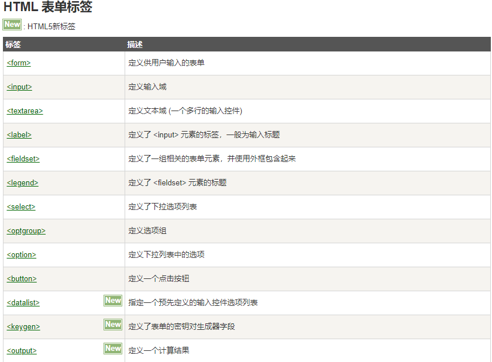

## HTML 表单和输入

> HTML 表单用于收集不同类型的用户输入

## HTML 表单

> 表单是一个包含表单元素的区域

> 表单元素是允许用户在表单中输入内容,比如：文本域(textarea)、下拉列表、单选框(radio-buttons)、复选框(checkboxes)等等。

> **表单使用表单标签 <form> 来设置**

```html
<form>

    用户名：<input type="text">

</form>
```

## HTML 表单 - 输入元素

> **注意:表单本身并不可见。同时，在大多数浏览器中，文本域的默认宽度是 20 个字符**

> 多数情况下被用到的表单标签是输入标签`（<input>）`

> 输入类型是由**类型属性（type）定义的**。大多数经常被用到的输入类型如下

```html
文本域（Text Fields）
    <input type="text"> 标签来设定
密码字段
    密码字段通过标签<input type="password"> 来定义
单选按钮（Radio Buttons）
    <input type="radio"> 标签定义了表单单选框选项
    给定属性name就可以实现单选
提交按钮(Submit Button)
    <input type="submit"> 定义了提交按钮.
```

```html
下拉列表
<form>
    <select>
    <option value="1">1</option>
    <option value="2">2</option>
    <option value="3">3</option>
    </select>
</form>
有预设值的下拉列表
在需要设置的预设值里添加selected
<option value="3" selected>3</option>
```

