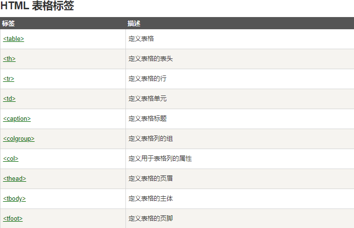

## HTML 表格

> 表格由<table>定
>
> 每个表格的行由<tr>标签定义
>
> 每行被风格为单元格由<td>标签定义
>
> 字母td指表格数据(table data)，即数据单元格的内容。数据单元格可以包含文本、图片、列表、段落、表单、水平线、表格等等

```html
<table border="1">  #border表示表格边框线  不写border表示无边框
            <tr>>
                <td>1</td>
                <td>2</td>
            </tr>
            <tr>
                <td>1</td>
                <td>2</td>
            </tr>
        </table>
```

## HTML 表格表头

> 表格的表头使用 <th> 标签进行定义。

> 大多数浏览器会把表头显示为粗体居中的文本

```html
<table border="1">
            <tr>
                <th>head1</th>
                <th>head2</th>
            </tr>
            <tr>
                <td>1</td>
                <td>2</td>
            </tr>
            <tr>
                <td>1</td>
                <td>2</td>
            </tr>
        </table>
```

带标题表头

```html
<table>
    <caption>标题</caption>
    ......
</table>
```


