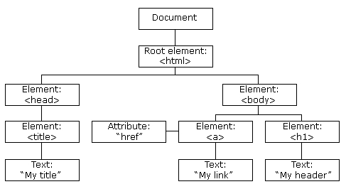

> 通过 HTML DOM，可访问 JavaScript HTML 文档的所有元素

## HTML DOM (文档对象模型)

> 当网页被加载时，浏览器会创建页面的文档对象模型（Document Object Model）

HTML DOM 模型被构造为对象的树

 

通过可编程的对象模型，JavaScript 获得了足够的能力来创建动态的 HTML

- JavaScript 能够改变页面中的所有 HTML 元素
- JavaScript 能够改变页面中的所有 HTML 属性
- JavaScript 能够改变页面中的所有 CSS 样式
- JavaScript 能够对页面中的所有事件做出反应

## 查找 HTML 元素

通常，通过 JavaScript，您需要操作 HTML 元素。

为了做到这件事情，您必须首先找到该元素。有三种方法来做这件事

- 通过 id 找到 HTML 元素
- 通过标签名找到 HTML 元素
- 通过类名找到 HTML 元素

## 通过 id 查找 HTML 元素

> 在 DOM 中查找 HTML 元素的最简单的方法，是通过使用元素的 id。

本例查找 id="demo" 元素

```JS
<p id="demo">hello world</p>
<script>
  x =document.getElementById("demo");
  document.write("<p>" + x.innerHTML + "<p>")
</script>
如果未找到该元素，则 x 将包含 null
```

## 通过标签名查找 HTML 元素

```js
<p>你好世界!</p>
<div id="main">
<p> DOM 是非常有用的。</p>
</div>
<script>
var x=document.getElementById("main");
var y=x.getElementsByTagName("p");
document.write('id="main"元素中的第一个段落为：' + y[0].innerHTML);
</script>
```

## 通过类名找到 HTML 元素

```JS
<p class="intro">你好世界!</p>
<script>
x=document.getElementsByClassName("intro");
document.write("<p>文本来自 class 为 intro 段落: " + x[0].innerHTML + "</p>");
</script>
```

