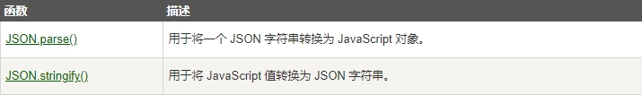

> JSON 是用于存储和传输数据的格式
>
> JSON 通常用于服务端向网页传递数据

## 什么是 JSON?

- JSON 英文全称 JavaScript Object Notation
- JSON 是一种轻量级的数据交换格式。
- JSON是独立的语言 *
- JSON 易于理解。

> *JSON 使用 JavaScript 语法，但是 JSON 格式仅仅是一个文本。

> 文本可以被任何编程语言读取及作为数据格式传递

## JSON 实例

以下 JSON 语法定义了 sites 对象: 3 条网站信息（对象）的数组

```js
{"sites":[
  {"name":"Runoob", "url":"www.runoob.com"},
  {"name":"Google", "url":"www.google.com"},
  {"name":"Taobao", "url":"www.taobao.com"}
]}
```

## JSON 格式化后为 JavaScript 对象

> JSON 格式在语法上与创建 JavaScript 对象代码是相同的。

由于它们很相似，所以 JavaScript 程序可以很容易的将 JSON 数据转换为 JavaScript 对象。

## JSON 语法规则

- 数据为 **键/值 对**。
- 数据由**逗号分隔**。
- **大括号保存对象**
- **方括号保存数组**

## JSON 数据 - 一个名称对应一个值

JSON 数据格式为 键/值 对，就像 JavaScript 对象属性。

> 键/值对包括字段名称（在双引号中），后面一个冒号，然后是值：

```js
"name":"Runoob"
```

## JSON 对象

> JSON 对象保存在大括号内。

> 就像在 JavaScript 中, 对象可以保存多个 键/值 对：

```js
{"name":"Runoob", "url":"www.runoob.com"}
```

## JSON 数组

> JSON 数组保存在中括号内。

> 就像在 JavaScript 中, 数组可以包含对象

```JS
"sites":[

  {"name":"Runoob", "url":"www.runoob.com"},

  {"name":"Google", "url":"www.google.com"},

  {"name":"Taobao", "url":"www.taobao.com"}

]
```

## JSON 字符串转换为 JavaScript 对象

通常我们从服务器中读取 JSON 数据，并在网页中显示数据。

> 简单起见，我们网页中直接设置 JSON 字符串

首先，创建 JavaScript 字符串，字符串为 JSON 格式的数据：

```JS
var text = '{ "sites" : [' +

'{ "name":"Runoob" , "url":"www.runoob.com" },' +

'{ "name":"Google" , "url":"www.google.com" },' +

'{ "name":"Taobao" , "url":"www.taobao.com" } ]}';
```

> 然后，使用 JavaScript 内置函数 JSON.parse() 将字符串转换为 JavaScript 对象:

```JS
var obj = JSON.parse(text);
```

最后，在你的页面中使用新的 JavaScript 对象：

```JS
var text = '{ "sites" : [' +

  '{ "name":"Runoob" , "url":"www.runoob.com" },' +

  '{ "name":"Google" , "url":"www.google.com" },' +

  '{ "name":"Taobao" , "url":"www.taobao.com" } ]}';

  

obj = JSON.parse(text);

document.getElementById("demo").innerHTML = obj.sites[1].name + " " + obj.sites[1].url;
```

## 相关函数



