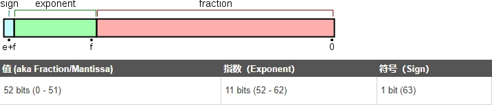
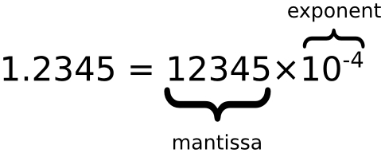
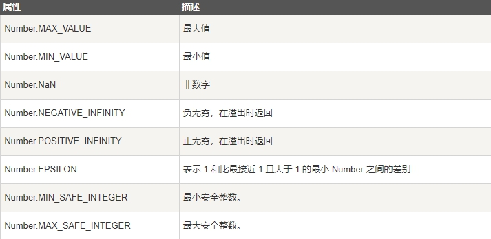
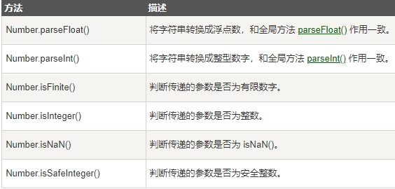
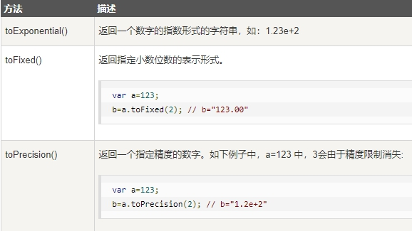

> JavaScript 只有一种数字类型。

> 可以使用也可以不使用小数点来书写数字。

## JavaScript 数字

JavaScript 数字可以使用也可以不使用小数点来书写

```JS
var pi=3.14;  // 使用小数点
var x=34;    // 不使用小数点
```

> 极大或极小的数字可通过科学（指数）计数法来写：

```JS
var y=123e5;  // 12300000
var z=123e-5;  // 0.00123
```

## 所有 JavaScript 数字均为 64 位

> JavaScript 不是类型语言。与许多其他编程语言不同，JavaScript 不定义不同类型的数字，比如整数、短、长、浮点等等。

> 在JavaScript中，数字不分为整数类型和浮点型类型，所有的数字都是由 浮点型类型。JavaScript 采用 IEEE754 标准定义的 64 位浮点格式表示数字，它能表示最大值（Number.MAX_VALUE）为 ±1.7976931348623157e+308，最小值（Number.MIN_VALUE）为 ±5e-324

> 此格式用 64 位存储数值，其中 0 到 51 存储数字（片段），52 到 62 存储指数，63 位存储符号：

 

 

## 精度

> 整数（不使用小数点或指数计数法）最多为 15 位

```JS
var x = 999999999999999; // x 为 999999999999999 
var y = 9999999999999999; // y 为 10000000000000000
```

> 小数的最大位数是 17，但是浮点运算并不总是 100% 准确：

```JS
var x = 0.2+0.1; // 输出结果为 0.30000000000000004
```

## 八进制和十六进制

如果前缀为 0，则 JavaScript 会把数值常量解释为八进制数，如果前缀为 0 和 "x"，则解释为十六进制数

```JS
var y = 0377;
var z = 0xFF;
```

绝不要在数字前面写零，除非您需要进行八进制转换

## 无穷大（Infinity）

> 当数字运算结果超过了JavaScript所能表示的数字上限（溢出），结果为一个特殊的无穷大（infinity）值，在JavaScript中以Infinity表示。同样地，当负数的值超过了JavaScript所能表示的负数范围，结果为负无穷大，在JavaScript中以-Infinity表示。无穷大值的行为特性和我们所期望的是一致的：基于它们的加、减、乘和除运算结果还是无穷大（当然还保留它们的正负号）

```JS
myNumber=2;
while (myNumber!=Infinity)
{
  myNumber=myNumber*myNumber; // 重复计算直到 myNumber 等于 Infinity
}
```

> 除以0也产生了无限:

```JS
var x = 2/0;
var y = -2/0;
```

## NaN - 非数字值

> NaN 属性是代表非数字值的特殊值。该属性用于指示某个值不是数字。可以把 Number 对象设置为该值，来指示其不是数字值。

> 你可以使用 isNaN() 全局函数来判断一个值是否是 NaN 值。

```JS
var x = 1000 / "Apple";
isNaN(x); // 返回 true
var y = 100 / "1000";
isNaN(y); // 返回 false
```

除以0是无穷大，无穷大是一个数字:

```JS
var x = 1000 / 0;
isNaN(x); // 返回 false
```

## 数字可以是数字或者对象

> 数字可以私有数据进行初始化，就像 x = 123;

> JavaScript 数字对象初始化数据， var y = new Number(123);

```JS
var x = 123;
var y = new Number(123);
typeof(x) // 返回 Number
typeof(y) // 返回 Object
```

## Number 属性

 

## 数字方法

 

## 数字类型原型上的一些方法

 

 

 

 

 

 

 

 

 

 

 

 

 

 