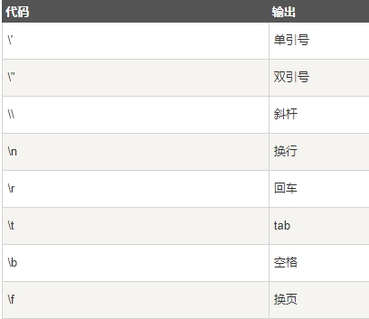

String 对象用于处理已有的字符块

## JavaScript 字符串

一个字符串用于存储一系列字符就像 "John Doe".

> 一个字符串可以使用单引号或双引号：

> 你使用位置（索引）可以访问字符串中任何的字符：

```
var character=carname[7];
```

> 字符串的索引从零开始, 所以字符串第一字符为 [0],第二个字符为 [1], 等等。
>
> 可以在字符串中使用转义字符(\)使用引号：

```js
var answer='It\'s alright';
var answer="He is called \"Johnny\"";
```

## 字符串（String）

> 字符串（String）使用长度属性length来计算字符串的长度

```js
var txt="Hello World!";
document.write(txt.length);
 
var txt="ABCDEFGHIJKLMNOPQRSTUVWXYZ";
document.write(txt.length);
```

## 在字符串中查找字符串

> 字符串使用 indexOf() 来定位字符串中某一个指定的字符首次出现的位置

```JS
var str="Hello world, welcome to the universe.";
var n=str.indexOf("welcome");
```

> 如果没找到对应的字符函数返回-1
>
> lastIndexOf() 方法在字符串末尾开始查找字符串出现的位置。

## 内容匹配

> match()函数用来查找字符串中特定的字符，并且如果找到的话，则返回这个字符。

```JS
var str="Hello world!";
document.write(str.match("world") + "
");
document.write(str.match("World") + "
");
document.write(str.match("world!"));
```

替换内容

> replace() 方法在字符串中用某些字符替换另一些字符。

```JS
str="Please visit Microsoft!"
var n=str.replace("Microsoft","Runoob");
```

## 字符串转为数组

> 字符串使用split()函数转为数组:

```JS
txt="a,b,c,d,e"  // String
txt.split(",");  // 使用逗号分隔
txt.split(" ");  // 使用空格分隔
txt.split("|");  // 使用竖线分隔
```

## 特殊字符

Javascript 中可以使用反斜线（\）插入特殊符号，如：撇号,引号等其他特殊符号。

查看如下 JavaScript 代码:

 

## 字符串属性和方法

属性:

- length
- prototype
- constructor

方法:

- charAt()
- charCodeAt()
- concat()
- fromCharCode()
- indexOf()
- lastIndexOf()
- match()
- replace()
- search()
- slice()
- split()
- substr()
- substring()
- toLowerCase()
- toUpperCase()
- valueOf()


 