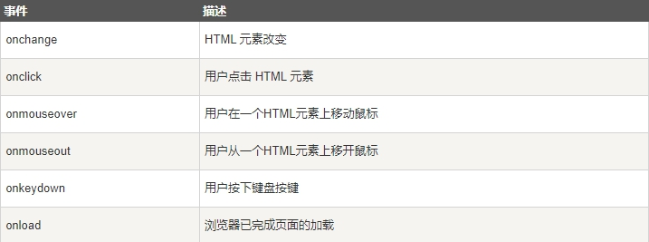

> HTML 事件是**发生在 HTML 元素上的事情**

当在 HTML 页面中使用 JavaScript 时， JavaScript 可以触发这些事件

## HTML 事件

> HTML 事件可以是**浏览器行为**，也可以是**用户行为**

以下是 HTML 事件的实例：

* HTML 页面完成加载

* HTML input 字段改变时

* HTML 按钮被点击

通常，当事件发生时，你可以做些事情。

在事件触发时 JavaScript 可以执行一些代码。

> HTML 元素中可以添加事件属性，使用 JavaScript 代码来添加 HTML 元素。

单引号:

```js
<some-HTML-element some-event='JavaScript 代码'>
```

双引号:

```js
<some-HTML-element some-event="JavaScript 代码">
```

## 常见的HTML事件



