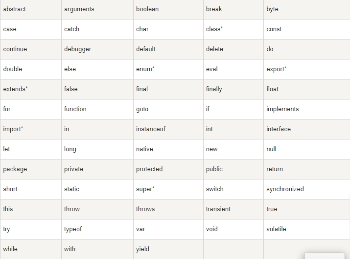
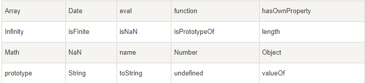
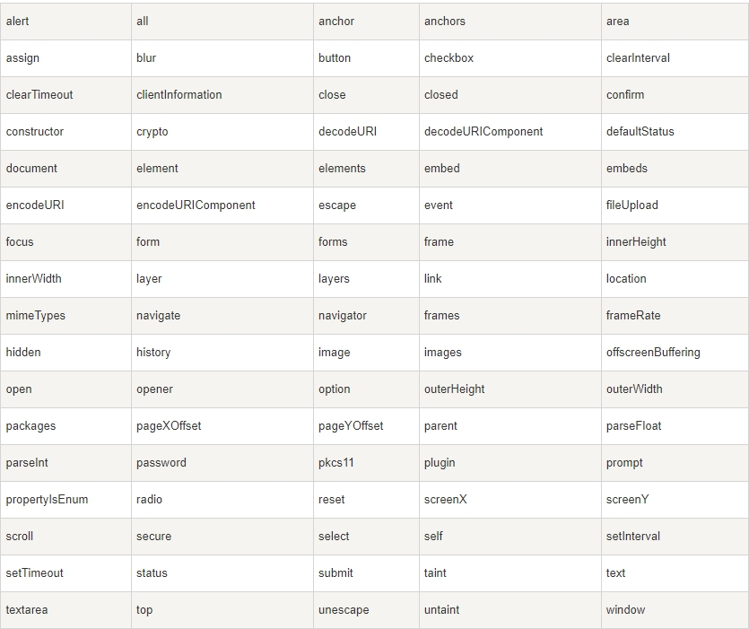
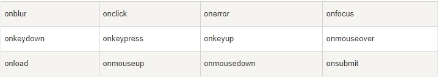

在 JavaScript 中，一些标识符是保留关键字，不能用作变量名或函数名

## JavaScript 标准

所有的现代浏览器完全支持 ECMAScript 3（ES3，JavaScript 的第三版，从 1999 年开始）。

ECMAScript 4（ES4）未通过。

ECMAScript 5（ES5，2009 年发布），是 JavaScript 最新的官方版本。

随着时间的推移，我们开始看到，所有的现代浏览器已经完全支持 ES5。

## JavaScript 保留关键字

> Javascript 的保留关键字不可以用作变量、标签或者函数名。有些保留关键字是作为 Javascript 以后扩展使用

 

> \* 标记的关键字是 ECMAScript5 中新添加的

## JavaScript 对象、属性和方法

> 您也应该避免使用 JavaScript 内置的对象、属性和方法的名称作为 Javascript 的变量或函数名

 

## Windows 保留关键字

 

## HTML 事件句柄

> 除此之外，您还应该避免使用 HTML 事件句柄的名称作为 Javascript 的变量及函数名

 

## 非标准 JavaScript

> 除了保留关键字，在 JavaScript 实现中也有一些非标准的关键字。

> 一个实例是 const 关键字，用于定义变量。 一些 JavaScript 引擎把 const 当作 var 的同义词。另一些引擎则把 const 当作只读变量的定义。

> Const 是 JavaScript 的扩展。JavaScript 引擎支持它用在 Firefox 和 Chrome 中。但是它并不是 JavaScript 标准 ES3 或 ES5 的组成部分。建议：不要使用它

 

 

 

 

 

 

 

 

 

 