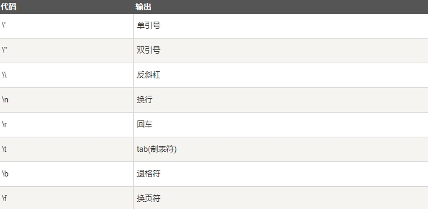
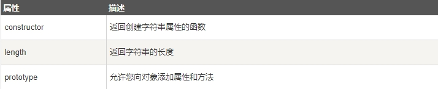
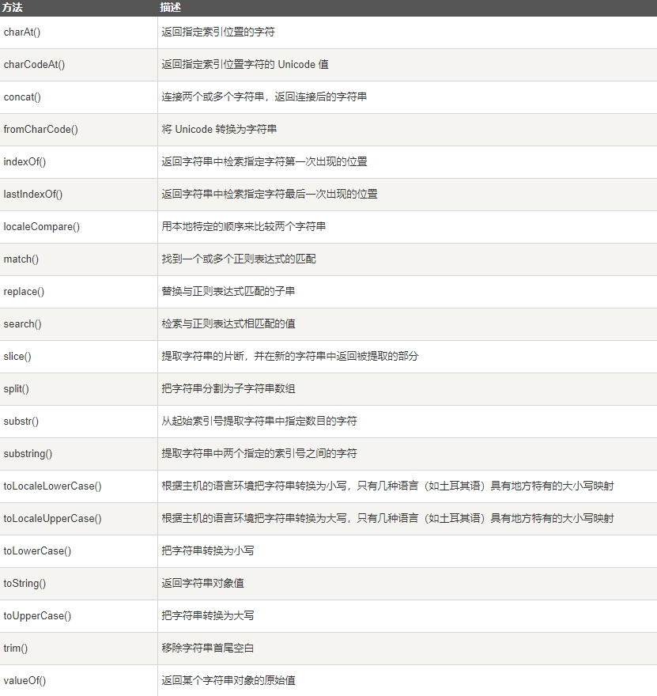

JavaScript 字符串用于存储和处理文本

## JavaScript 字符串

> 字符串可以存储一系列字符，如 "John Doe"

> 字符串可以是插入到**引号中的任何字符**。你可以**使用单引号或双引号**

```js
var carname = "Volvo XC60";

var carname = 'Volvo XC60';
```

你可以使用索引位置来访问字符串中的每个字符

```js
var character = carname[7];
```

你可以在字符串中使用引号，字符串中的引号不要与字符串的引号相同

```js
var answer = "It's alright";

var answer = "He is called 'Johnny'";

var answer = 'He is called "Johnny"';
```

你也可以在字符串添加转义字符来使用引号

```js
var x = 'It\'s alright';

var y = "He is called \"Johnny\"";
```

## 字符串长度

> 可以使用内置属性**length** 来计算字符串的长度

```js
<script>
   var text = "hello world!"
   document.write(text.length)
</script>
```

## 特殊字符

> 反斜杠是一个转义字符。 转义字符将特殊字符转换为字符串字符
> 转义字符 (\) 可以用于转义撇号，换行，引号，等其他特殊字符

下表中列举了在字符串中可以使用转义字符转义的特殊字符

 

## 字符串可以是对象

> 通常， JavaScript 字符串是**原始值**，可以**使用字符创建**： var firstName = "John"

> 但我们**也可以使用 new 关键字**将字符串**定义为一个对象**： var firstName = **new String("John")**

```js
<p id="demo"></p>
<script>

var x = "John";       // x是一个字符串

var y = new String("John"); // y是一个对象

document.getElementById("demo").innerHTML =typeof x + " " + typeof y;

</script>
```

不要创建 String 对象。它会拖慢执行速度，并可能产生其他副作用

```js
var x = "John";       

var y = new String("John");

(x === y) // 结果为 false，因为 x 是字符串，y 是对象
```

**=== 为绝对相等，即数据类型与值都必须相等**

## 字符串属性和方法

> 原始值可以使用 JavaScript 的属性和方法，因为 JavaScript 在**执行方法和属性时可以把原始值当作对象**

字符串属性

 

字符串方法



