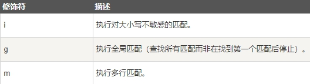
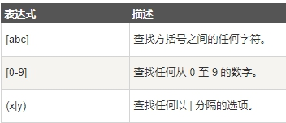
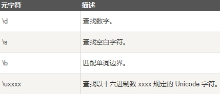
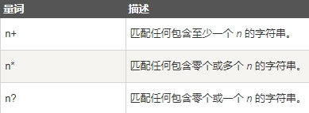

> 正则表达式（英语：Regular Expression，在代码中常简写为regex、regexp或RE）使用单个字符串来描述、匹配一系列符合某个句法规则的字符串搜索模式

## 语法

```js
/正则表达式主体/修饰符(可选)
```

其中修饰符是可选的

```js
var patt = /runoob/i

/runoob/是主体

i是修饰符(搜索不区分大小写)
```

## 使用字符串方法

> 在 JavaScript 中，正则表达式通常用于两个字符串方法 : search() 和 replace()

* search() 方法 用于检索字符串中指定的子字符串，或检索与正则表达式相匹配的子字符串，并返回子串的起始位置

* replace() 方法 用于在字符串中用一些字符替换另一些字符，或替换一个与正则表达式匹配的子串

## search() 方法使用正则表达式

使用正则表达式搜索 "Runoob" 字符串，且不区分大小写

```js
var str = "Visit Runoob!";

var n = str.search(/Runoob/i);

输出：6
```

## search() 方法使用字符串

> search 方法可使用字符串作为参数。字符串参数会转换为正则表达式

```js
检索字符串中 "Runoob" 的子串

var str = "Visit Runoob!";

var n = str.search("Runoob");
```

## replace() 方法使用正则表达式

> 使用正则表达式且不区分大小写将字符串中的 Microsoft 替换为 Runoob

```js
var str = document.getElementById("demo").innerHTML;

var txt = str.replace(/microsoft/i,"Runoob");
```

## replace() 方法使用字符串

> replace() 方法将接收字符串作为参数

```js
var str = document.getElementById("demo").innerHTML;

var txt = str.replace("Microsoft","Runoob");
```

> **正则表达式参数可用在以上方法中 (替代字符串参数)。
> 正则表达式使得搜索功能更加强大(如实例中不区分大小写)**

## 正则表达式修饰符

> 修饰符 可以在全局搜索中不区分大小写

 

## 正则表达式模式

> 方括号用于查找某个范围内的字符

 

> 元字符是拥有特殊含义的字符

 

量词

 

## 使用 RegExp 对象

> 在 JavaScript 中，RegExp 对象是一个预定义了属性和方法的正则表达式对象

## 使用 test()

> test() 方法是一个正则表达式方法

> test() 方法用于检测一个字符串是否匹配某个模式，如果字符串中含有匹配的文本，则返回 true，否则返回 false

```js
以下实例用于搜索字符串中的字符 "e"

var patt = /e/;

patt.test("The best things in life are free!");

字符串中含有e，所以输出true
```

> 你可以不用设置正则表达式的变量，以上两行代码可以合并为一行

```js
/e/.test("The best things in life are free!")
```

## 使用 exec()

> exec() 方法是一个正则表达式方法
>
> exec() 方法用于检索字符串中的正则表达式的匹配

> 该函数返回一个数组，其中存放匹配的结果。如果未找到匹配，则返回值为 null

```js
以下实例用于搜索字符串中的字母 "e"

/e/.exec("The best things in life are free!");

字符串中含有 "e"，所以该实例输出e
```

