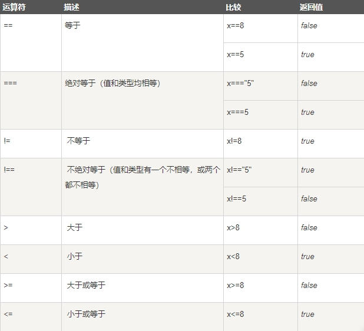
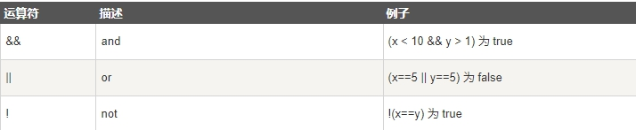

> 比较和逻辑运算符用于测试 true 或者 false

## 比较运算符

 

## 如何使用

> 可以在条件语句中使用比较运算符对值进行比较，然后根据结果来采取行动

```js
if (age<18) x="Too young";
```

## 逻辑运算符

 

## 条件运算符

> JavaScript 还包含了基于某些条件对变量进行赋值的条件运算符

语法

```js
variablename=(condition)?value1:value2
```

如果变量 age 中的值小于 18，则向变量 voteable 赋值 "年龄太小"，否则赋值 "年龄已达到

```js
<script>
  function myfunction()
  {
    var age,standerd;
    age = document.getElementById("age").value;
    standerd=(age<18)?"未成年":"成年";
    document.getElementById("demo").innerHTML=standerd;
  }
</script>
```

