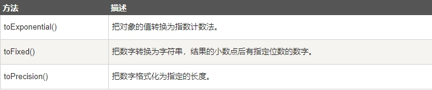
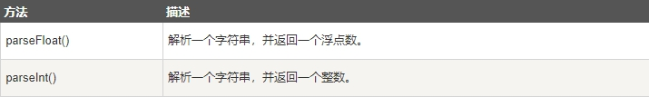

## JavaScript 数据类型

6 种不同的数据类型

* string

* number

* boolean

* object

* function

* symbol

3 种对象类型

* Object

* Date 

* Array

2 个不包含任何值的数据类型

* null

* undefined

## typeof 操作符

* NaN 的数据类型是 number

* 数组(Array)的数据类型是 object

* 日期(Date)的数据类型为 object

* null 的数据类型是 object

* 未定义变量的数据类型为 undefined

> 如果对象是 JavaScript Array 或 JavaScript Date ，我们就无法通过 typeof 来判断他们的类型，因为都是 返回 object

## constructor 属性

> constructor 属性返回所有 JavaScript 变量的构造函数

```js
"John".constructor         // 返回函数 String() { [native code] }
(3.14).constructor         // 返回函数 Number() { [native code] }
false.constructor         // 返回函数 Boolean() { [native code] }
[1,2,3,4].constructor       // 返回函数 Array()  { [native code] }
{name:'John', age:34}.constructor // 返回函数 Object() { [native code] }
new Date().constructor       // 返回函数 Date()  { [native code] }
function () {}.constructor     // 返回函数 Function(){ [native code] }
```

你可以使用 constructor 属性来查看对象是否为数组 (包含字符串 "Array"):

```js
function isArray(myArray) {
  return myArray.constructor.toString().indexOf("Array") >-1;
}
```

你可以使用 constructor 属性来查看对象是否为日期 (包含字符串 "Date"):

```js
function isDate(myDate) {
  return myDate.constructor.toString().indexOf("Date") > -1;
}
```

## JavaScript 类型转换

> JavaScript 变量可以转换为新变量或其他数据类型

* 通过使用 JavaScript 函数

* 通过 JavaScript 自身自动转换

## 将数字转换为字符串

> 全局方法 String() 可以将数字转换为字符串

> 该方法可用于任何类型的数字，字母，变量，表达式

```js
String(x)     // 将变量 x 转换为字符串并返回
String(123)    // 将数字 123 转换为字符串并返回
String(100 + 23) // 将数字表达式转换为字符串并返回
```

> Number 方法 toString() 也是有同样的效果

```js
x.toString()
(123).toString()
(100 + 23).toString()
```

 

## 将布尔值转换为字符串

> 全局方法 String() 可以将布尔值转换为字符串

```js
String(false)    // 返回 "false"
String(true)     // 返回 "true"
```

> Boolean 方法 toString() 也有相同的效果

```js
false.toString()   // 返回 "false"
true.toString()   // 返回 "true"
```

## 将日期转换为字符串

> **Date() 返回字符串**

```js
Date()   // 返回 Thu Jul 17 2014 15:38:19 GMT+0200 (W. Europe Daylight Time)
```

> 全局方法 String() 可以将日期对象转换为字符串

```js
String(new Date())   // 返回 Thu Jul 17 2014 15:38:19 GMT+0200 (W. Europe Daylight Time)
```

> Date 方法 toString() 也有相同的效果

```js
obj = new Date()
obj.toString()  // 返回 Thu Jul 17 2014 15:38:19 GMT+0200 (W. Europe Daylight Time)
```

## 将字符串转换为数字

> 全局方法 Number() 可以将字符串转换为数字

字符串包含数字(如 "3.14") 转换为数字 (如 3.14).

> 空字符串转换为 0。

> 其他的字符串会转换为 NaN (不是个数字)

```js
Number("3.14")  // 返回 3.14
Number(" ")    // 返回 0
Number("")    // 返回 0
Number("99 88")  // 返回 NaN
```

 

## 一元运算符 +

> Operator + 可用于将变量转换为数字

```js
var y = "5";   // y 是一个字符串
var x = + y;   // x 是一个数字
```

> 如果变量不能转换，它仍然会是一个数字，但值为 NaN (不是一个数字):

```js
var y = "John";  // y 是一个字符串
var x = + y;   // x 是一个数字 (NaN)
```

## 将布尔值转换为数字

> 全局方法 Number() 可将布尔值转换为数字

```js
Number(false)   // 返回 0

Number(true)   // 返回 1
```

## 将日期转换为数字

> 全局方法 Number() 可将日期转换为数字

```js
d = new Date();

Number(d)     // 返回 1404568027739
```

> 日期方法 getTime() 也有相同的效果

```js
d = new Date();

d.getTime()    // 返回 1404568027739
```

## 自动转换类型

> 当 JavaScript 尝试操作一个 "错误" 的数据类型时，会自动转换为 "正确" 的数据类型

```js
5 + null  // 返回 5     null 转换为 0
"5" + null // 返回"5null"  null 转换为 "null"
"5" + 1   // 返回 "51"   1 转换为 "1"
"5" - 1   // 返回 4     "5" 转换为 5
```

## 自动转换为字符串

> 当你尝试输出一个对象或一个变量时 JavaScript 会自动调用变量的 toString() 方法

```js
document.getElementById("demo").innerHTML = myVar;
myVar = {name:"Fjohn"} // toString 转换为 "[object Object]"
myVar = [1,2,3,4]    // toString 转换为 "1,2,3,4"
myVar = new Date()   // toString 转换为 "Fri Jul 18 2014 09:08:55 GMT+0200"
```

