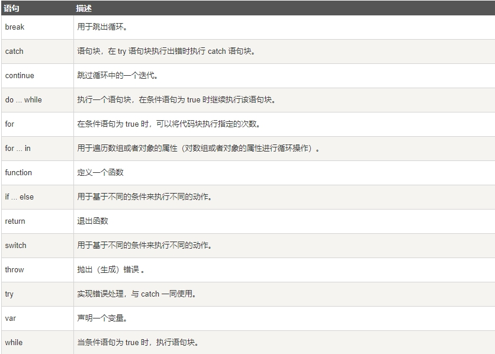

> JavaScript 语句向浏览器发出的命令。语句的作用是告诉浏览器该做什么

## JavaScript 语句

> JavaScript 语句是发给浏览器的命令

这些命令的作用是告诉浏览器要做的事情

## JavaScript 代码

JavaScript 代码是 JavaScript 语句的序列

浏览器按照编写顺序依次执行每条语句

## JavaScript 代码块

> JavaScript 可以分批地组合起来

> 代码块以左花括号开始，以右花括号结束

> 代码块的作用是一并地执行语句序列

本例向网页输出一个标题和两个段落

```js
<h1>我的 Web 页面</h1>
<p id="myPar">我是一个段落。</p>
<div id="myDiv">我是一个div。</div>
<p>
<button type="button" onclick="myFunction()">点击这里</button>
</p>
<script>
function myFunction(){
  document.getElementById("myPar").innerHTML="你好世界！";
  document.getElementById("myDiv").innerHTML="你最近怎么样?";
}
</script>
<p>当您点击上面的按钮时，两个元素会改变。</p>

```

## JavaScript 语句标识符

> JavaScript 语句通常以一个 语句标识符 为开始，并执行该语句

> 语句标识符是保留关键字不能作为变量名使用

下表列出了 JavaScript 语句标识符 (关键字)

 

## 空格

> JavaScript 会忽略多余的空格。您可以向脚本添加空格，来提高其可读性。下面的两行代码是等效的

```js
var person="runoob";
var person = "runoob";
```

## 对代码行进行折行

> 您可以在文本字符串中使用反斜杠对代码行进行换行。下面的例子会正确地显示``

```js
<script>
document.write("你好 \
世界!");
</script>
```

不过，您不能像这样折行

```js
document.write \
("你好世界!");
```

> **知识点：JavaScript 是脚本语言，浏览器会在读取代码时，逐行地执行脚本代码。而对于传统编程来说，会在执行前对所有代码进行编译**

 

