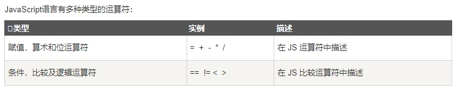
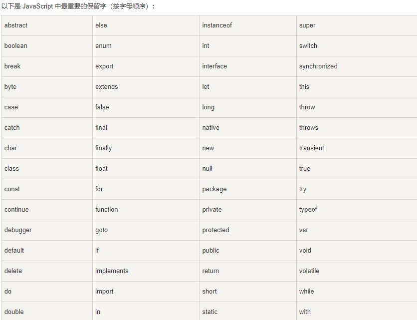

JavaScript 是一个程序语言。语法规则定义了语言结构

## JavaScript 语法

JavaScript 是一个脚本语言。

它是一个轻量级，但功能强大的编程语言。

## JavaScript 字面量

在编程语言中，一般固定值称为字面量，如 3.14

> 数字（Number）字面量 可以是整数或者是小数，或者是科学计数(e)

> 字符串（String）字面量 可以使用单引号或双引号

> 表达式字面量 用于计算

> 数组（Array）字面量 定义一个数组

```js
[40, 100, 1, 5, 25, 10]
```

> 对象（Object）字面量 定义一个对象

```js
{firstName:"John", lastName:"Doe", age:50, eyeColor:"blue"}
```

> 函数（Function）字面量 定义一个函数

```js
function myFunction(a, b) { return a * b;}
```

## JavaScript 变量

> JavaScript 使用关键字 var 来定义变量， 使用等号来为变量赋值

```js
<p id="demo"></p>
<script>
var length;
length = 6;
document.getElementById("demo").innerHTML = length;
</script>
```

## JavaScript 操作符

> JavaScript使用 算术运算符 来计算值

```js
document.getElementById("demo").innerHTML = (5 + 6) * 10;
```

> JavaScript使用赋值运算符给变量赋值

```js
<script>
var x, y, z;
x = 5;
y = 6;
z = (x + y) * 10;
document.getElementById("demo").innerHTML = z;
</script>
```

 

## JavaScript 语句

在 HTML 中，JavaScript 语句向浏览器发出的命令

> 语句是用分号分隔：

## JavaScript 关键字

> JavaScript 关键字用于标识要执行的操作

和其他任何编程语言一样，JavaScript 保留了一些关键字为自己所用。

> var 关键字告诉浏览器创建一个新的变量

 

## JavaScript 注释

不是所有的 JavaScript 语句都是"命令"。双斜杠 // 后的内容将会被浏览器忽略

```js
// 我不会被执行
```

## JavaScript 数据类型

> JavaScript 有多种数据类型：数字，字符串，数组，对象等等

```js
var length = 16;                 // Number 通过数字字面量赋值
var points = x * 10;               // Number 通过表达式字面量赋值
var lastName = "Johnson";             // String 通过字符串字面量赋值
var cars = ["Saab", "Volvo", "BMW"];       // Array 通过数组字面量赋值
var person = {firstName:"John", lastName:"Doe"}; // Object 通过对象字面量赋值
```

## 数据类型的概念

### JavaScript 函数

> JavaScript 语句可以写在函数内，函数可以重复引用

> **引用一个函数 = 调用函数(执行函数内的语句)**

```js
function myFunction(a, b) {
  return a * b;                // 返回 a 乘以 b 的结果
}
```

### JavaScript 字母大小写

> **JavaScript 对大小写是敏感的
> 函数 getElementById 与 getElementbyID 是不同的
> 同样，变量 myVariable 与 MyVariable 也是不同的**

### JavaScript 字符集

> JavaScript 使用 Unicode 字符集

### 格式

> JavaScript 中，常见的是驼峰法的命名规则，如 lastName (而不是lastname)

 

