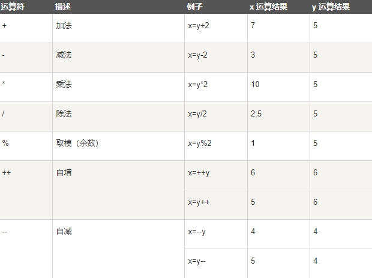
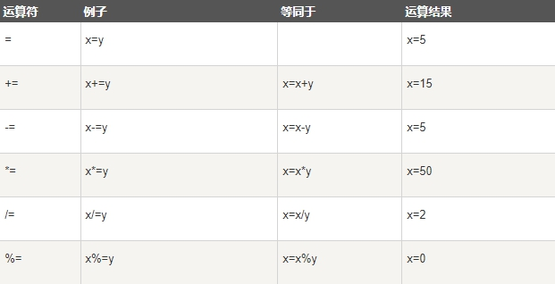

运算符 = 用于赋值

运算符 + 用于加值

运算符` = `用于给 JavaScript 变量赋值

算术运算符 + 用于把值加起来

## JavaScript 算术运算符

 

## JavaScript 赋值运算符

> 赋值运算符用于给 JavaScript **变量赋值**

给定 x=10 和 y=5，下面的表格解释了赋值运算符

 

## 用于字符串的 + 运算符

\+ 运算符用于把文本值或字符串变量加起来（连接起来）

如需把**两个或多个字符串变量连接起来**，请使用 + 运算符

```js
txt1="What a very";

txt2="nice day";

txt3=txt1+txt2;

输出：What a verynice day
```

## 对字符串和数字进行加法运算

数字与字符串相加，返回字符串，如下实例

```js
z="Hello"+5;

输出：Hello5
```

