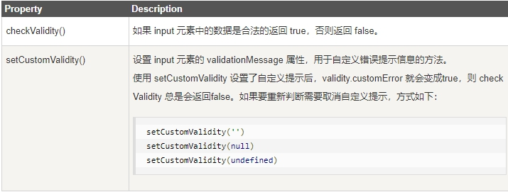
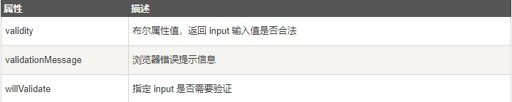
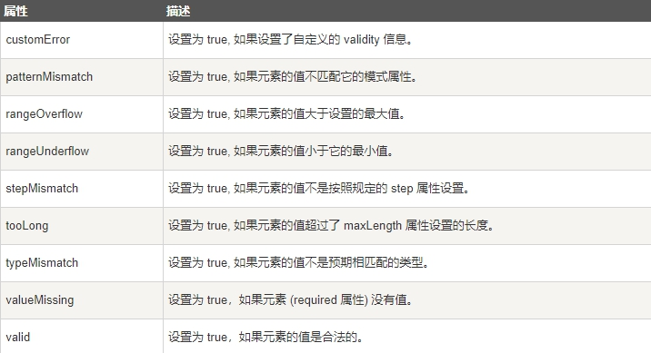

## 约束验证 DOM 方法

 

以下实例如果输入信息不合法，则返回错误信息

```js
<input id="id1" type="number" min="100" max="300" required>

<button onclick="myFunction()">验证</button>

<p id="demo"></p>

<script>

function myFunction() {

  var inpObj = document.getElementById("id1");

  if (inpObj.checkValidity() == false) {

​    document.getElementById("demo").innerHTML = inpObj.validationMessage;

  }

}

</script>
```

## 约束验证 DOM 属性

 

## Validity 属性

input 元素的 validity 属性包含一系列关于 validity 数据属性：



