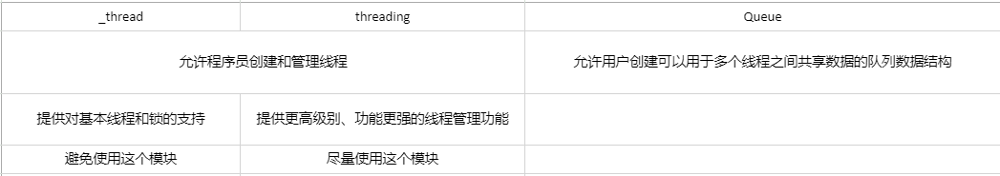
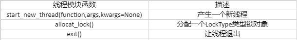
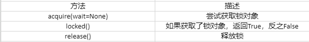
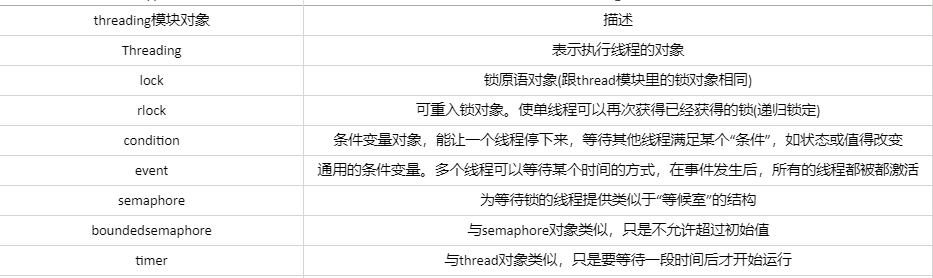
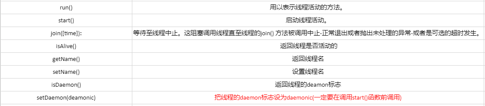

## 进程和线程

> 进程

**进程(Process，重量级进程)**是计算机中的程序在某数据集合上的一次运行活动，是资源分配调度的基本单位，操作系统结构的基础，程序是指令、数据及其组织形式的描述，进程是程序的实体。**每个进程都有自己的地址空间、内存、数据栈已经记录运行轨迹的辅助数据**，进程可以通过fork和spawn操作完成其他任务

> 线程

**线程(Thread，轻量级进程)和进程相似，所有线程运行在一个进程中，共享运行环境**

线程有**开始**，**顺序执行**和**结束**三部分，线程在运行中可能出现**抢占（中断）情况或暂时被挂起（睡眠）**，从而让其他线程运行，**这称为让步，线程比进程之间更方便共享数据和项目通信**

线程一般并发执行，在进程的整个运行过程中，每个线程都只做自己的是，需要是再跟其他线程共享运行结果。多个线程共同访问同一块数据空并不是没有危险，由于数据访问你顺序不一样，因此可能导致数据结果不一样，这叫做竞态条件，线程库中都有一系列不同原语，用于控制线程的执行和数据的访问

> 多进程和多线程

真正的并发执行多任务只能在多核cpu上实现，由于任务数量远远多于CPU的核心数量，因此操作系统会自动把很多任务轮流调度到每个核心 上执行

对于操作系统来说，任务就是进程。有些进程不止干一件事，比如word可以同时进行打字，打印等事情，要同时干多见识，就需要同时运行多个“子任务”，进程中的“子任务”就称作线程

多任务的实现有3中方式：多进程模式、多线程模式、多进程+多线程模式

由此可知，线程是最小的执行单元，而进程由至少一个线程组成。调度进程和线程完全由操作系统决定

---

## 使用线程

### 全局解释器锁

> 虽然Python解释器可以“运行”多个线程，**但是在任意时刻只有一个线程在Python解释器中运行**

> Python虚拟机的访问由全局解释器锁(GIL)控制，这个锁能保证同一时刻只有一个线程运行

在多线程环境中，虚拟机按一下方式执行：

1. 设置GIL
2. 切换到一个线程并运行
3. 运行指定数量的字节码指令或线程主动让出控制(time.slee(0))
4. 把线程设置为睡眠状态
5. 解锁GIL
6. 再次重复以上所以步骤

----

### 退出线程

> 线程退出方法有 调用`_thread.exit()`等退出函数，标准退出方法(调用`sys.exit()`或抛出`SystemExit`异常)，**不可以直接杀掉进程**

> 使用_thread模块会导致主线程退出时，其他线程没有清除就退出。

> 使用Threading模块能确保所有“重要的”子线程都退出后，进程才会结束

### Python的线程模块



---

## _thread模块

> 可调用_thread模块中的start_new_thread()函数产生新线程

```python
_thread.start_new_thread(function,args[,kwargs])
```

function为线程函数；args为传递给线程函数的参数，必须是元素类型；kwargs为可选参数

_thread还提供锁对象(lock object，也叫原语锁、简单锁、互斥锁、互斥量、二值信号量)

> _thread模块中常用的线程模块函数：



> LockType类型锁对象常用方法：



---

## threading模块

> threading里所有的对象



### 守护线程

有一种线程，它是在后台运行的，它的任务是为其他线程提供服务，这种线程被称为**“后台线程（Daemon Thread）”**，又称为**“守护线程”**或**“精灵线程”**。Python 解释器的垃圾回收线程就是典型的后台线程。

**后台线程有一个特征，如果所有的前台线程都死亡了，那么后台线程会自动死亡。**

**调用 Thread 对象的 daemon 属性可以将指定线程设置成后台线程。**

设置守护线程两种方法：

```python
1. 主动将线程的 daemon 属性设置为 True。
thread.setDaemon(True)
2. 后台线程启动的线程默认是后台线程。
```

### Thread对象

> Thread对象是属于threading模块里面的，而thread模块自己单独的一个模块，切记两个不是同一个东西

Thread对象提供的函数



使用Thread对象穿件线程3中方法

1. 创建一个Thread对象，传给他一个函数
2. 创建一个Thread对象，传给他一个可调用的类对象
3. 从Thread类派生一个子类，创建该子类的一个实例(通常使用这一种)

```python
#多线程方法1
from threading import Thread

def MyThread():#定义子线程在开始执行之后需要完成的任务
    for x in range(100):
        print("子线程",x)

if __name__ == '__main__':
    t = Thread(target=MyThread)#创建子线程，target给予任务
    t.start()   #子线程启动，但是什么时候启动开始由CPU决定
    for i in range(100):#测试主线程
        print("主线程",i)

#通常使用这种方法
#多线程方法2
class Myfunction(Thread):#Thread是Myfunction的父类，Myfunction继承父类的方法
    def run(self):#run是固定 当线程被执行的时候，执行的就是这个run()
        for x in range(100):
            print('子线程',x)


if __name__ == '__main__':
    t = Myfunction()
    t.start()
    for i in range(100):
        print('主线程',i)
```

* Queue模块 (待续)
* 线程池 (待续)
* 进程池 (待续)

