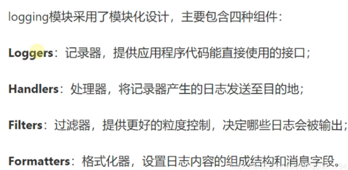
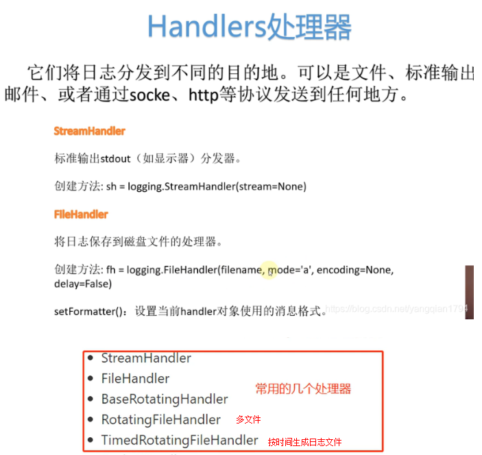
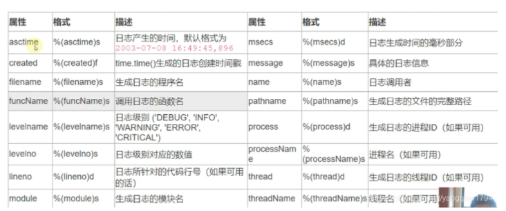

## 异常

调试程序时，经常会爆出一些异常，产生异常的原因有两个方面。一方面，可能是写程序时疏忽或考虑不全造成了错误，这是就要根据异常追踪到出错点，进行分析改正另一方面，有些异常时不可避免的，但可以对异常进行捕获处理，防止程序终止

----

### 错误与异常的概念

* 错误无法通过其他代码进行处理，如语法错误和逻辑错误。语法错误是单词或格式等写错，只能找到相应的代码进行修改异常是程序执行过程中出现的未知问题，这里语法和逻辑都是正确的，可以通过其他代码进行处理修复，使用if判定语句来避免，使用捕捉异常可以避免除零移除等等
* 常见的系统异常如下：
* 除零异常：被除数写成了0
* 名称异常：变量未定义
* 类型异常：对不同类型的数据进行相加
* 索引异常：超出索引返回
* 键异常：没有对应名称的键
* 值异常：将字符型数据转换成整型数据
* 属性异常：对象没有对应名称的属性
* 迭代器异常：迭代次数超出迭代器中的元素个数

---

### python内置异常

异常也是对象，可对它们进行操作。`BaseException`是所有异常的基类，但用户定义的类并不直接继承`BaseException`，所有的异常类都从Exception继承，且都在exceptions模块中定义

> **内置异常类的层次结构：**

```python
BaseException  # 所有异常的基类
+-- SystemExit  # 解释器请求退出
+-- KeyboardInterrupt  # 用户中断执行(通常是输入^C)
+-- GeneratorExit  # 生成器(generator)发生异常来通知退出
+-- Exception  # 常规异常的基类
      +-- StopIteration  # 迭代器没有更多的值
      +-- StopAsyncIteration  # 必须通过异步迭代器对象的__anext__()方法引发以停止迭代
      +-- ArithmeticError  # 各种算术错误引发的内置异常的基类
      |    +-- FloatingPointError  # 浮点计算错误
      |    +-- OverflowError  # 数值运算结果太大无法表示
      |    +-- ZeroDivisionError  # 除(或取模)零 (所有数据类型)
      +-- AssertionError  # 当assert语句失败时引发
      +-- AttributeError  # 属性引用或赋值失败
      +-- BufferError  # 无法执行与缓冲区相关的操作时引发
      +-- EOFError  # 当input()函数在没有读取任何数据的情况下达到文件结束条件(EOF)时引发
      +-- ImportError  # 导入模块/对象失败
      |    +-- ModuleNotFoundError  # 无法找到模块或在在sys.modules中找到None
      +-- LookupError  # 映射或序列上使用的键或索引无效时引发的异常的基类
      |    +-- IndexError  # 序列中没有此索引(index)
      |    +-- KeyError  # 映射中没有这个键
      +-- MemoryError  # 内存溢出错误(对于Python 解释器不是致命的)
      +-- NameError  # 未声明/初始化对象 (没有属性)
      |    +-- UnboundLocalError  # 访问未初始化的本地变量
      +-- OSError  # 操作系统错误，EnvironmentError，IOError，WindowsError，socket.error，select.error和mmap.error已合并到OSError中，构造函数可能返回子类
      |    +-- BlockingIOError  # 操作将阻塞对象(e.g. socket)设置为非阻塞操作
      |    +-- ChildProcessError  # 在子进程上的操作失败
      |    +-- ConnectionError  # 与连接相关的异常的基类
      |    |    +-- BrokenPipeError  # 另一端关闭时尝试写入管道或试图在已关闭写入的套接字上写入
      |    |    +-- ConnectionAbortedError  # 连接尝试被对等方中止
      |    |    +-- ConnectionRefusedError  # 连接尝试被对等方拒绝
      |    |    +-- ConnectionResetError    # 连接由对等方重置
      |    +-- FileExistsError  # 创建已存在的文件或目录
      |    +-- FileNotFoundError  # 请求不存在的文件或目录
      |    +-- InterruptedError  # 系统调用被输入信号中断
      |    +-- IsADirectoryError  # 在目录上请求文件操作(例如 os.remove())
      |    +-- NotADirectoryError  # 在不是目录的事物上请求目录操作(例如 os.listdir())
      |    +-- PermissionError  # 尝试在没有足够访问权限的情况下运行操作
      |    +-- ProcessLookupError  # 给定进程不存在
      |    +-- TimeoutError  # 系统函数在系统级别超时
      +-- ReferenceError  # weakref.proxy()函数创建的弱引用试图访问已经垃圾回收了的对象
      +-- RuntimeError  # 在检测到不属于任何其他类别的错误时触发
      |    +-- NotImplementedError  # 在用户定义的基类中，抽象方法要求派生类重写该方法或者正在开发的类指示仍然需要添加实际实现
      |    +-- RecursionError  # 解释器检测到超出最大递归深度
      +-- SyntaxError  # Python 语法错误
      |    +-- IndentationError  # 缩进错误
      |         +-- TabError  # Tab和空格混用
      +-- SystemError  # 解释器发现内部错误
      +-- TypeError  # 操作或函数应用于不适当类型的对象
      +-- ValueError  # 操作或函数接收到具有正确类型但值不合适的参数
      |    +-- UnicodeError  # 发生与Unicode相关的编码或解码错误
      |         +-- UnicodeDecodeError  # Unicode解码错误
      |         +-- UnicodeEncodeError  # Unicode编码错误
      |         +-- UnicodeTranslateError  # Unicode转码错误
      +-- Warning  # 警告的基类
           +-- DeprecationWarning  # 有关已弃用功能的警告的基类
           +-- PendingDeprecationWarning  # 有关不推荐使用功能的警告的基类
           +-- RuntimeWarning  # 有关可疑的运行时行为的警告的基类
           +-- SyntaxWarning  # 关于可疑语法警告的基类
           +-- UserWarning  # 用户代码生成警告的基类
           +-- FutureWarning  # 有关已弃用功能的警告的基类
           +-- ImportWarning  # 关于模块导入时可能出错的警告的基类
           +-- UnicodeWarning  # 与Unicode相关的警告的基类
           +-- BytesWarning  # 与bytes和bytearray相关的警告的基类
           +-- ResourceWarning  # 与资源使用相关的警告的基类。被默认警告过滤器忽略。
```

---

### requests模块的相关异常

> 在做爬虫时，requests是十分好用的模块，要调用request模块的内置异常，只要使用“from requests.exceptions import xxx”就可以了

**requests模块的内置异常类的层次结构：**

```python
IOError
+-- RequestException  # 处理不确定的异常请求
      +-- HTTPError  # HTTP错误
      +-- ConnectionError  # 连接错误
      |    +-- ProxyError  # 代理错误
      |    +-- SSLError  # SSL错误
      |    +-- ConnectTimeout(+-- Timeout)  # (双重继承，下同)尝试连接到远程服务器时请求超时，产生此错误的请求可以安全地重试。
      +-- Timeout  # 请求超时
      |    +-- ReadTimeout  # 服务器未在指定的时间内发送任何数据
      +-- URLRequired  # 发出请求需要有效的URL
      +-- TooManyRedirects  # 重定向太多
      +-- MissingSchema(+-- ValueError) # 缺少URL架构(例如http或https)
      +-- InvalidSchema(+-- ValueError) # 无效的架构，有效架构请参见defaults.py
      +-- InvalidURL(+-- ValueError)  # 无效的URL
      |    +-- InvalidProxyURL  # 无效的代理URL
      +-- InvalidHeader(+-- ValueError)  # 无效的Header
      +-- ChunkedEncodingError  # 服务器声明了chunked编码但发送了一个无效的chunk
      +-- ContentDecodingError(+-- BaseHTTPError)  # 无法解码响应内容
      +-- StreamConsumedError(+-- TypeError)  # 此响应的内容已被使用
      +-- RetryError  # 自定义重试逻辑失败
      +-- UnrewindableBodyError  # 尝试倒回正文时，请求遇到错误
      +-- FileModeWarning(+-- DeprecationWarning)  # 文件以文本模式打开，但Requests确定其二进制长度
      +-- RequestsDependencyWarning  # 导入的依赖项与预期的版本范围不匹配
Warning
+-- RequestsWarning  # 请求的基本警告
```

---

### 用户自定义异常

> python运行用户自定义异常，可以通过创建新的异常类拥有自己的异常。用户自定义异常时应该通过直接或间接的方式继承Exception类，下面创建MyError类，基类为Exception，用于在触发异常时输出更多信息

> 在try语句块中，抛出用于自定义异常后执行except部分，变量e是用于创建MyError类的实例：

```python
class MyError(Exception):
    def __init__(self, msg):
        self.msg = msg


    def __str__(self):
        return self.msg


try:
    raise MyError('类型错误')
except MyError as e:
    print('My exception occurred', e.msg)
```

---

## 异常处理

* **当发生异常时，需要对异常进行捕获，然后进行相应的处理。进行异常处理捕获需要使用try...except...结构，把可能发生错误的语句放入try语句块中，用except处理异常，每一个try都必须至少对应一个except**
* Python异常相关的关键字表：

|    关键    | 关键字说明                                      |
| :--------: | :---------------------------------------------- |
| try/except | 捕获异常并处理                                  |
|    pass    | 忽略异常                                        |
|     as     | 定义异常实例(except MyError as e)               |
|    else    | 如果try中的语句没有引发异常，则执行else中的语句 |
|  finally   | 无论是否出现异常都执行的代码                    |
|   raise    | 抛出/引出异常                                   |

---

### 捕获所有异常

> **捕获所有异常，包括键盘中断和出现退出请求(用sys.exit()就无法退出程序了，因为异常被捕获了)因此慎用：**

```python
try:
    <语句>
except:
    print('异常说明')
```

---

### 捕获指定异常

```python
try:
    <语句>
except<异常名>:
    print('异常说明')
捕获任意异常：
try:
    <语句>
except Exception；
    print('异常说明')
```

---

### 捕获多个异常

> 捕获对个异常有两种方式，第一种是一个except同时处理多个异常，不区分优先级 语法如下：

```python
try:
    <语句>
except(<异常名1>,<异常名2>,....)：
    print('异常说明')
第二种是区分优先级的，语法：
try:
    <语句>
except <异常名1>：
    print('异常说明1')
except <异常名2>：
    print('异常说明2')
except <异常名3>：
    print('异常说明3')
```

**这种异常处理语法的规则是：**

1. 执行try中的语句，如果引发异常，则执行过程会跳到一个except语句
2. 如果第一个except中定义的异常与引发的异常匹配，则执行该except中的语句
3. 如果引发的异常不匹配第一个except，就搜索第二个excpt，允许编写的except数量不受限制
4. 如果所有的except都不匹配，则异常会被传递到下一个调用该代码的最高层try中

---

### 异常中的else

```python
判断玩没有异常之后，如果还想做其他事，就可以使用else语句：
try:
    <语句>
except<异常名1>:
    print('异常说明1')
except <异常名2>：
    print('异常说明2')
else:
    <语句>#try与语句没有异常，则执行此段代码
```

---

### 异常中的finally

> 对于try...finally..语句，无论是否发生异常都将被执行最后的代码：

```python
try:
    <语句>
finally:
    <语句>
```

---

### 使用raise语句主动抛出异常

```python
raise[Exception[,args[,traceback]]]
```

Exception表示异常的类型；args参数可选，是异常的参数。参数traceback表示异常追踪对象，也是可选的异常是类，捕获异常就是捕获类的实例。因此，异常并不是凭空产生的，而是有意创建并抛出的如果要抛出异常，可以首先根据需要，定义异常类，选择好继承关系，然后使用raise语句抛出异常类的实例

---

### 使用traceback模块查看异常

> 程序调佣函数时，会在“函数调用堆栈”的起始出插入函数名，一旦异常被引发，就会搜索相应的异常处理程序，如果当前函数中没有异常处理程序，当前函数会终止，Python会搜索当前函数的调用函数，以此类推，知道发现匹配的异常处理出现，或者python抵达主程序为止，这以过程就称为**“堆栈辗转开解”**（Stack Unwinding）

```python
import traceback


try:
    block
except:
    traceback.print.exc()
示例程序：
import traceback


try:
    1/0
except Exception as e:
    print(e)
```

---

## 程序调试

### 调试

> print打印出来 （有效，简单）

---

### 断言(assert)

> 凡是使用print函数辅助查看的地方，都可以用断言来代替

```python
def foo(s):
    n = int(s)
    assert n != 0,'n is zero'
    return 10/n
foo('0')
```

assert的意思是，表达式n!=0应该是TRUE，否则，后面的代码就会出错如果断言失败，assert语句本身就会抛出`AssertionError`异常

---

### logging

把print函数替换为logging是第三种凡是，和assert相比，logging不会抛出错误，而且可以输出到文件中：

```python
import logging


#默认的日日志输出级别为warning，所以debug和info不输出


logging.basicConfig(
level=logging.DEBUG, #使用baseConfig()来指定日志输出级别level
filename = 'demo.log', #保存到当前目录 默认追加 不覆盖
filemode = 'w' #默认追加 开启写入模式
"""
astime当前时间
level日志级别
filename文件名
lineno日志生成的行数
message日志内容
format自定义格式
"""
)
logging.debug('this is debug')
logging.info('this is debug')
logging.warning('this is debug')
logging.error('this is debug')
logging.critical('this is debug')
"""
级别:DEBUF<INFO<WARNING<ERROR<CRITICAL
"""
```

---

### logging高级应用



----

#### **loggers记录器**

```python
# 提供应用程序的调用接口
# 单例
logger = logging.getLogger(__name__)

# 决定日志记录级别
looger.setLevel()

# 将日志传送到相关的handlers中
logger.addHandler()和logger.removeHandler()
```

---

#### **handlers处理器**



---

#### Formatters格式



```python
import logging


logger = looging.getLogger('yq')
# logger的级别和Handler级别默认取最小
# 若需要在Handler输出指定级别，logger需指定DEBUG
logger = setLevel(logging.DEBUG)  


# 声明处理器
# debug输出到控制台
consoleHandler = logging.StreamHandler()
consoleHandler,setLevel(logging.DEBUG)


# 没有指定setLevel将继承logger的级别DEBUG
fileHandler = logging.FileHandler(filename = "addDemo.log")
consoleHandler,setLevel(logging.INFO)


# formatter格式同简单用法
formatter1 = logging.Formatter(格式一)
formatter2 = logging.Formatter(格式二)


# 给处理器设置格式
consoleHandler.setFormatter(formatter1)
fileHandler.setFormatter(formatter2)


# 记录器设置处理器
logger.addHander(consoleHandler)
logger.addHander(fileHandler)


# 定义过滤器 控制不同用户输出
fit = logging.Filter("cn.cccb")
# 关联过滤器
logger.addFilter(fit)
consoleHandler.addFilter(fit)


# 输出日志
#logging.debug()
#loging.info()
#logging.warning()
#loging.error()
#logging.critical()
```

#### **pdb**

> pdb是python的调试器，让程序以单步方式运行，可以随时查看运行状态

