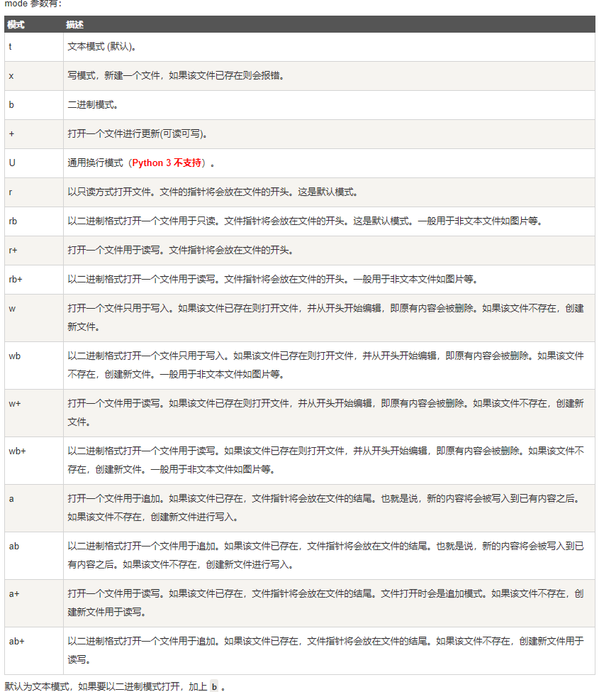
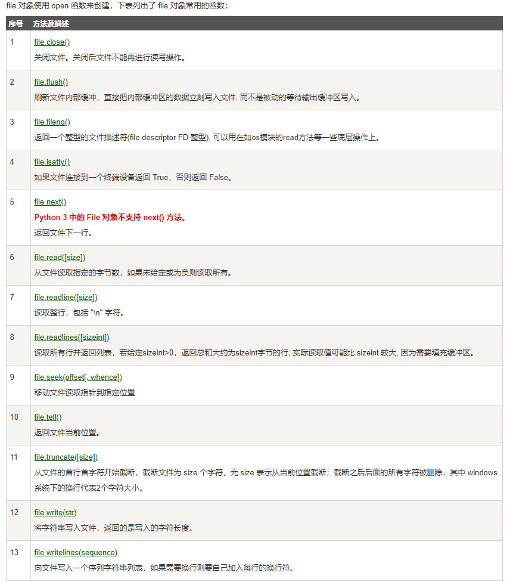
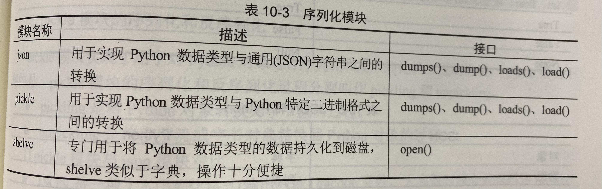
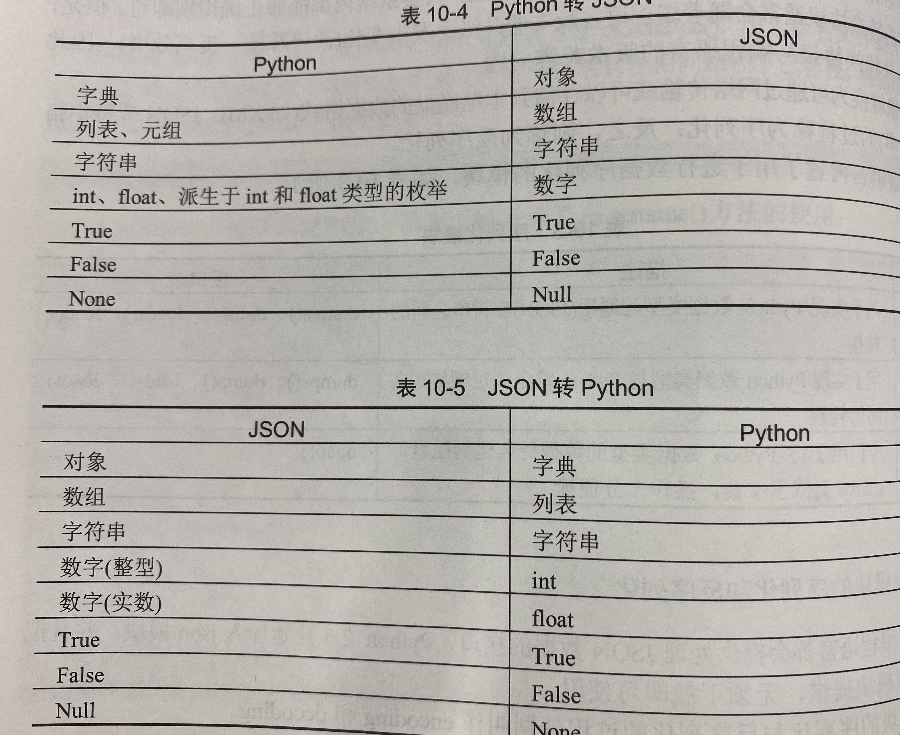

## 基本文件操作

#### open()打开文件常用语法

```python
open(file,mode='r')
```

完整语法格式：

```python
open(file, mode='r',buffering=-1,encoding=None,errors=None,newline=None,closefd=True,opener=None)
```

* file:必需参数，带路径，的文件名称
* mode：可选参数，文件打开模式，默认为r
* buffering：用于设置缓冲策略
* encoding：编码或解码方式。默认编码方式依赖平台，如果需要特殊设置，可以参考codecs模块，获取编码列表。一般使用utf-8
* errors：报错级别，可选参数
* newline：换行标志符，可取值有None '\n' '\r' 。输入时，如果参数值为None，那么行结束的标志符可以是'\n' '\r' '\n\r'中的任意一个，并且这三个标志符都会首先被转换为'\n'，然后才会被调用
* closefd：传入的file参数类型
* opener：必须返回所打开文件的描述

#### 操作文件的流程

1. 打开文件，得到文件内容
2. 通过内容对文件进行操作
3. **关闭文件close()**
4. 简单示例：

```python
filename = input("请输入文件名：")
f = open(filename,mode='w')#写的模式打开文件
while True:
    cont = input("请输入end结束写入")
    if cont =='end':#输出end结束写入
        f.close()#关闭文件
        break
    else:
        f.write(cont)#反之，写入内容
fread = open(filename,mode='r')#读的模式打开文件
readcont = fread.read()#获取到文件内容放到变量
print(readcont)#打印文件内容
```

#### 文件模式



* 使用open()函数时，明确指定读模式和什么模式都不指定的效果是一样的，使用写模式可以向文件写入内容。+参数可以用到其他任何模式中，以指定读写都是允许的，比如，w+可以在打开文件时用于文件的读写当参数带有字母b时，表示可以用来读取二进制文件。
* open()函数默认为文本模式，如果要以二进制模式打开，加上字母b

#### 缓冲

* 缓冲一般指内存，计算机从内存中读取数据的速度远远大于从磁盘读取数据的速度，一般内存大于远小于磁盘大小，内存的速度比较快，但资源比较紧张，所以有必要对数据进行缓冲设置文件缓冲行为分为全缓冲、行缓冲、无缓冲，设置如下：

```python
open('','',buffering=a)#使用buffering设置缓冲行为
```

* 全缓冲：a是正整数，当缓冲区大小达到a指定的大小时，写入磁盘
* 行缓冲：设置buffering=1，缓冲区碰到\n换行符时就写入磁盘
* 无缓冲：设置buffering=0，写多少，存多少**注意：对于text文件类型必须写缓冲区**

#### **基本文件方法**



> 在对文件对象的常用方法进行学习之前，首先了解一下流的概念。I/O编程中，Stream（流）是一个很重要的概念，可以把流想象成一根管子，数据就是水流中的水，但是只能单向流动，输入流就是数据从外面流入内存，输出元流就是数据从内存流到外面去，需要建立两根水管，才能又能发送数据又能接收数据

#### 读和写

> 文件对象提高了一组访问方法，主要通过使用read（）和write（）方法来读取和写入文件

##### read()

> read方法用于从文件读取指定的字节数，如果未给定或为负，**则读取所有内容**，语法格式：

```python
fileobject.read([size])
```

参数size指定从文件中读取字节数

##### readline()

> readline方法用于从文件读取整行，包括\n字符 语法：

```python
fileobject.readline(size)
```

> readline方法占用内存小，适合大文件

##### readlines()

* readlines方法用于读取所有行直到文件结束符EOF，并返回一个列表，该列表可以由python的for in 结构来处理
* read方法逐个读取文件，处理比较繁琐
* readline方法每次读出一行内容，读取是内存较小
* readlines方法读取整个文件的所有行，会比较占内存

##### write()

> 如果文件打开模式带有字母b，那么写入内容时，str参数要用编码方法转换为字符串形式，否则报错

```python
fileobject.write([str])
```

##### **close()**

* close方法用于关闭已打开的文件，关闭后文件不能再进行读写操作，否则报错
* 使用close关闭文件是一个好习惯

```python
fileobject.close()
```

#### 重命名

os模块提高了文件和目录重命名方法os.rename() 语法如下：

```python
os.rename(src.dst)
os.rename#方法没有返回值。
```

#### **序列化和反序列化**

> 将对象转换为可通过网络传输或可以存储到本地磁盘的数据格式(如xml，json等)的过程称为序列化，反之，则称为反序列化



#### **JSON模块的序列化和反序列化**

* encoding：把python对象转换成json字符串
* decoding：把json字符串转换成python对象


* 在序列化和反序列化操作过程中，json和python之间数据类型的对应关系如表：



**需要注意的是：**

* python字典中的键（非字符串）在转换成json是都被转换为小写字符串
* python中的元组在序列化时会被转换成数组，数组会被转换成列表
* pickle模块(暂时不写)
* shelve模块(暂时不写)
* 总结：
  * json模块常用于编写web接口，将python数据转换为通用的json格式，传递给其他客户端，也可以保存在本地文件中，缺点：明文保存，保密性差
  * pickle模块和shelve模块由于使用特有的序列协议，序列化之后只能被python识别
  * shelve模块可以看作pickle模块的升级版，因为使用了pickle的序列化协议

### 目录操作

#### 路径

模块os包含另一个模块ops.path，提供了操作路径的函数。使用os.path操作路径，可使程序易于移植，且可以处理一下特殊情形

使用os.path.join可将目录名称组合成路径。python使用适合操作系统的路径分隔符。在使用之前不要忘记导入os.path模块，例如：

