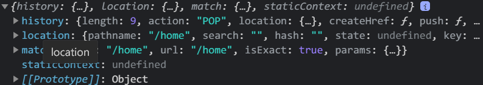
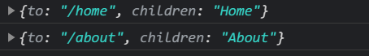
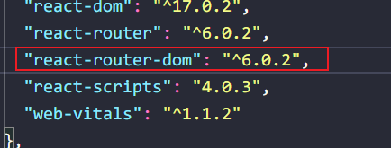

> react脚手架没有自带react-router-dom所有需要手动下载引入

> react有**两个**路由器管理对象
>
> 1. BrowserRouter
> 2. HashRouter

```bash
npm install react-router-dom //这里会下载最新的router
```

## V5

```react
npm install react-router-dom@5 --save
```


```react
import React, { Component } from "react";
import { BrowserRouter, Link, Route } from "react-router-dom";

import Home from "./Home";
import About from "./About";

class App extends Component {
  render() {
    return (
      <BrowserRouter>
        <div>
          <p>容器</p>
          {/* 编写路由链接 */}
          <Link to="/home">home</Link>
          <Link to="/about">about</Link>
          {/* 注册路由 */} //注意这里v5版本的区别
            //注意这里的Route并不是Router！！！
          <Route path="/home" component={Home} />
          <Route path="/about" component={About} />
        </div>
      </BrowserRouter>
    );
  }
}

export default App;
```

> 路由组件和一般组件的关键区别,就是props,一般组件不传props是没值的
>
> 而路由组件不传props,自带有东西



#### 实现导航点击高亮

> NavLink
>
> NavLink实现理念是,如果点击导航加载指定导航添加一个类名active
>
> 然后我们使用bootstrap,里面自带了一个active样式,这就显示了高亮
>
> 或者不引入bootstrap
>
> 我们可以写一个active这个样式供NavLink使用

```react
import React, { Component } from "react";
import { BrowserRouter, NavLink, Route } from "react-router-dom";

import Home from "./Home";
import About from "./About";

class App extends Component {
  render() {
    return (
      <BrowserRouter>
        <div>
          <p>容器</p>
          {/* 编写路由链接 */}
            //这里
          <NavLink to="/home">home</NavLink>
          <NavLink to="/about">about</NavLink>
          {/* 注册路由 */}
          <Route path="/home" component={Home} />
          <Route path="/about" component={About} />
        </div>
      </BrowserRouter>
    );
  }
}

export default App;

```

#### 封装NavLink

```react
import React, { Component } from "react";
import { BrowserRouter, NavLink, Route } from "react-router-dom";

import Home from "./Home";
import About from "./About";
import MyNavLink  from "./MyNavLink";

class App extends Component {
  render() {
    return (
      <BrowserRouter>
        <div>
          <p>容器</p>
          {/* 编写路由链接 */}
            {/* 封装的MyNavLink */}
          <MyNavLink to='/home'>Home</MyNavLink>
          <MyNavLink to='/about'>About</MyNavLink>
          {/* 注册路由 */}
          <Route path="/home" component={Home} />
          <Route path="/about" component={About} />
        </div>
      </BrowserRouter>
    );
  }
}

export default App;

```

```react
//MyNavLink.jsx  对NavLink二次开发
import React, { Component } from 'react';
import {NavLink} from 'react-router-dom' //引入

class MyNavLink extends React.Component {
  render() { 
      //这里可以直接写...this.props展开就行,并且会自动收到标签体内的内容就是children
    return <NavLink {...this.props}/>
  }
}

export default MyNavLink;
```

> `<p 标签属性>标签体内容</p>`
>
> **这里的标签体内容可以收集到,并且会自动收集到props中,就在props.children中**




> 所以在MyNavLink中不用谢children,因为展开了props,自动使用children属性
>
> **标签体的内容就是children中的内容,children就表示标签体**

#### Switch

> Switch可以让路由匹配成功**第一个之后就不再往下匹配了**

```react
<Switch> //包住
    <Route path="/home" component={Home} />
    <Route path="/about" component={About} />
</Switch>
```


## V6

> react-router-dom  v6



> 所有需要路由器管理的路由都需要被*BrowserRouter*包裹

```react
import React, { Component } from "react";
import { BrowserRouter, Link, Route, Routes } from "react-router-dom";

import Home from "./Home";
import About from "./About";

class App extends Component {
  render() {
    return (
      <BrowserRouter> {/* 包裹 */}
        <p>容器</p>
        {/* 编写路由链接 */}
        <Link to="/home">home</Link>
        <Link to="/about">about</Link>
        {/* 注册路由 */}
        <Routes>
          <Route path="/home" element={<Home />} />
          <Route path="/about" element={<About />} />
        </Routes>
      </BrowserRouter> {/* 包裹 */}
    );
  }
}

export default App;

```

> 更加方便的包裹是,直接把*BrowserRouter*报错在index.js中

```react
index.js
import React from "react";
import ReactDOM from "react-dom";
import { BrowserRouter } from "react-router-dom"; //引入
import App from './App'

ReactDOM.render(
  <BrowserRouter>//包裹
    <App />
  </BrowserRouter>,
  document.getElementById("root"));
```

> 组件中取消

```react
import React, { Component } from "react";
import { Link, Route, Routes } from "react-router-dom";

import Home from "./Home";
import About from "./About";

class App extends Component {
  render() {
    return (
        //这里就不用BrowserRouter包裹了
      <div>
        <p>容器</p>
        {/* 编写路由链接 */}
        <Link to="/home">home</Link>
        <Link to="/about">about</Link>
        {/* 注册路由 */}
        <Routes>
          <Route path="/home" element={<Home />} />
          <Route path="/about" element={<About />} />
        </Routes>
      </div>
    );
  }
}

export default App;

```

## 路由组件

> 组件分为**路由组件**和**一般组件**
>
> 1. 参与路由的组件就是路由组件
>
> **需把路由组件放在路由文件下**
>
> pages/路由组件
>
> 2. 一般组件就是不参与路由的组件

```react
<Route path="/home" element={<Home />} /> //路由组件
<Home/> //一般组件
```

## 模糊匹配

> react-router是**默认使用模糊匹配**

```react
<BrowserRouter>
    <div>
        <p>容器</p>
        {/* 编写路由链接 */}
        //这里跳转的路径是home,但是这里是/home/a/b/c下面也可以自动模糊匹配的
        只有在第一个路径不是下面所匹配的时候才会匹配不上,如:/a/home/b
        <MyNavLink to="/home">Home</MyNavLink>
        <MyNavLink to="/about">About</MyNavLink>
        {/* 注册路由 */}
        <Switch>
            //这里匹配的路径是home
            <Route path="/home" component={Home} />
            <Route path="/about" component={About} />
        </Switch>
    </div>；‘
</BrowserRouter>
```

> 开启精准匹配
>
> 表示跳转的路径必须和匹配的路由一模一样
>
> `  exact={true}`
>
> **在没有耽搁页面的显示,是不必要开启精准匹配**
>
> 有些时候开启会导致**无法继续匹配二级路由**

```react
<Route exact={true} path="/home" component={Home} />
<Route exact={true} path="/about" component={About} />
//或者
<Route exact path="/home" component={Home} />
<Route exact path="/about" component={About} />
```

## Redirect使用

> Redirect的效果是,在一开始进入页面可以**指定一个路由页面为初始显示的页面**

```react
import { Redirect,Switch, BrowserRouter, NavLink, Route } from "react-router-dom";
<Switch>
    <Route path="/home" component={Home} />
    <Route path="/about" component={About} />
    //相当于兜底,我们访问http://localhost:3000/是没有东西展示的,但是可以使用Redirect指定显示那个页面
    <Redirect to="/home" />
</Switch>
```

## 嵌套路由(多级路由)

> **多级路由需要把前几级的路由地址写上,因为路由是顺序匹配的**
>
> 如:/home/about
>
> 先模糊匹配home,进到home之后显示about组件
>
> 在about组件内又匹配/home/about然后显示组件

```react
//App.js
<BrowserRouter>
    <div>
        <p>容器</p>
        {/* 编写路由链接 */}
        <MyNavLink to="/home">Home</MyNavLink>
        <MyNavLink to="/about">About</MyNavLink>
        {/* 注册路由 */}
        <Switch>
            <Route path="/home" component={Home} />
        </Switch>
    </div>
</BrowserRouter>
//about.js
<BrowserRouter>
    <div>
        <p>容器</p>
        {/* 编写路由链接 */}
        <MyNavLink to="/home/about">Home</MyNavLink>
        {/* 注册路由 */}
        <Switch>
            <Route path="/home/about" component={Home} />
        </Switch>
    </di v>
</BrowserRouter>
```

> 开启严格模式的话,在匹配**第一级路由**的时候就**不会模糊匹配**了,所以严格模式是分场合使用的

## 路由组件传递参数

#### params

```react
import React, { Component } from "react";
import { Redirect,Switch, BrowserRouter, NavLink, Route } from "react-router-dom";

import Home from "./Home";
import About from "./About";
import MyNavLink from "./MyNavLink";

class App extends Component {
  render() {
    return (
      <BrowserRouter>
        <div>
          {/* 向路由组件传递params参数 */}
          <MyNavLink to="/home/01/张三">Home</MyNavLink>
          <MyNavLink to="/about">About</MyNavLink>
          <Switch>
            {/* 声明接收params参数 */}
            <Route path="/home/:id/:name" component={Home} />
            <Route path="/about" component={About} />
          </Switch>
        </div>
      </BrowserRouter>
    );
  }
}

export default App;

```

```react
import React, { Component } from "react";

class Home extends React.Component {
  render() {
     //传递的参数放在props内
    console.log(this.props)
    return (
      <div style={{ background: "#f4e" }}>
        Home
      </div>
    );
  }
}

export default Home;
```


#### search(特别像query)

```react
<BrowserRouter>
    <div>
        {/* 向路由组件传递search参数 */}
        <MyNavLink to="/home/?id=1&name=张三">Home</MyNavLink>
        <MyNavLink to="/about">About</MyNavLink>
        <Switch>
            {/* search参数无需声明接收 */}
            <Route path="/home" component={Home} />
            <Route path="/about" component={About} />
        </Switch>
    </div>
</BrowserRouter>
```


> 接下来就可以把接收到的search参数进行格式整理
>
> 使用内置的一个库`querystring`

> 扩展:**key=value&key=value**.这种形式叫做**urlencoded**

```react
import qs from 'querystring'
												//截取第一位,因为?还在
const result= qs.parse(this.props.location.search.slice(1))//输出 {id='1',name='张三'}
```

## 编程式路由

> 编程式路由就是自己写跳转,不适用内置封装的东西,而是我**们自己编写事件来跳转**

> 有两个api可以使用:
>
> 1. this.props.history.replace(*path, state*)
> 2. this.props.history.push(*path, state*)


> 注意:编程式路由会调用api,这些api在第一个路由组件里面会提示.**replace undefined**,所以需要放到子路由组件里面
>
> **原因:因为App不是路由组件**

```react
import React, { Component } from "react";

class Home extends React.Component {

    //还有其他携带参数的方式,同理
    
  replaceShow=(id,title)=>{
    this.props.history.replace(`/home/${id}/${title}`)
    console.log('我是编程式replace')
  }

  replaceShow=(id,title)=>{
    this.props.history.push(`/home/${id}/${title}`)
    console.log('我是编程式push')
  }

  render() {
    console.log(this.props)
    return (
      <div style={{ background: "#f4e" }}>
        Home
        <p onClick={()=>this.replaceShow(1,'张三')}>home</p>
      </div>
    );
  }
}

export default Home;

```

## withRouter

> withRuter实现在**一般组件中**可以**使用路由**的东西

> `export default withRouter(组件名)`

```react
import React, { Component } from 'react';
import {withRouter} from 'react-router-dom'


class About extends React.Component {

  render() { 
    console.log(this.props) //现在这个组件就可以使用路由了
    return <div style={{background:'#f88'}}>About</div>;
  }
}
 
export default withRouter(About);//包裹导出
```

## BrowserRouter与HashRouter的区别

> 1. 底层原理不一样:
>    1. BrowserRouter使用的是**H5的history Api,**不兼容IE9及一下版本
>    2. HashRouter使用的是URL的**哈希值,**并且**url会加一个#**,#**之后**的东西不会发送给服务器
> 2. 刷新后对路由state参数的影响**(Vue好像也一样)**
>    1. BrowserROuter**没有任何影响**,因为state保存在history对象中
>    2. HashRouter刷新后会**导致路由state参数丢失**
