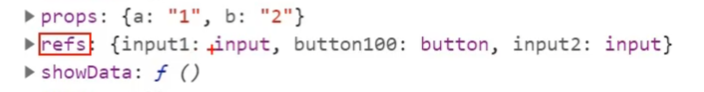

## 字符串形式的ref

> 字符串形式的ref就是在jsx节点标记时是用的字符串做标识符

```react
<ul ref='ul1'> //es6箭头函数 ()=>{}
	<li></li>
</ul>
```

```react
//获取
this.refs.xxx
```


> 字符串形式ref可能会在react后期版本**被废弃**,并且react官方**并不推荐使用字符串形式的ref**
>
> **因为效率不高**

## 回调形式的ref

> ref 可获取元素的信息
>
> 在指定元素上添加属性ref

```react
			//这里的c代表currentNode
<ul ref={(c)=>{this.ul1=c}}> //es6箭头函数 ()=>{}
	<li></li>
</ul>
```

> **在方法中**

```react
addList(){
        this.setState({
            list:[...this.state.list,this.state.InputValue],
            InputValue:''
            //这里setState自带了回调 可以在操作完dom之后再执行
        },()=>{console.log(this.ul.querySelectorAll('li').length)})
        //console.log(this.ul.querySelectorAll('li').length) 这种写法会出现一个坑,因为setState进行操作dom的时候是异步的操作,并没有在操作完才执行这个log,而是异步执行log,所有会打印出li的长度不一致的情况.
    };
```

> **ref的这个坑可以在其他场景进行**

> **refs就想当于元素html的id,只不过不需要docment.getElementBYid,而是直接在对象实例属性上拿**



> ref拿的是虚拟dom**转成真实dom的真实节点**

> ref在第一次页面**渲染**的时候只会**调用一次,**只有在**更新的时候才会调用两次**
>
> 调用的第一次是**null**
>
> 调用的第二次才是**节点**

> **解决这个问题**

> 不使用ref内联函数

```react
<ul ref=this.saveUl> //es6箭头函数 ()=>{}
	<li></li>
</ul>
```

```react
saveUl =(c) =>{
	this.ul1 = c
}
```

## **createRef**

> createRef是react的ref最新的方式(**最推荐的形式**)

> React.createRef调用后可以**返回一个容器**,该容器可以**存储被ref所标识的节点**
>
> 并且一个容器**只能装一个**ref,所以说**专人专用**

```react
class Item extends React.Component {
    myRef = React.createRef()

    render() { 
        			//myRef和上面的对应
        return <li ref={this.myRef} onClick={this.handleClick}>{this.props.listcontent}</li>;
    }
    handleClick=()=>{
        this.props.deleteList(this.props.index)
        console.log(this.myRef.current) //current表示节点,必须加
    }
}
export default Item;
```

